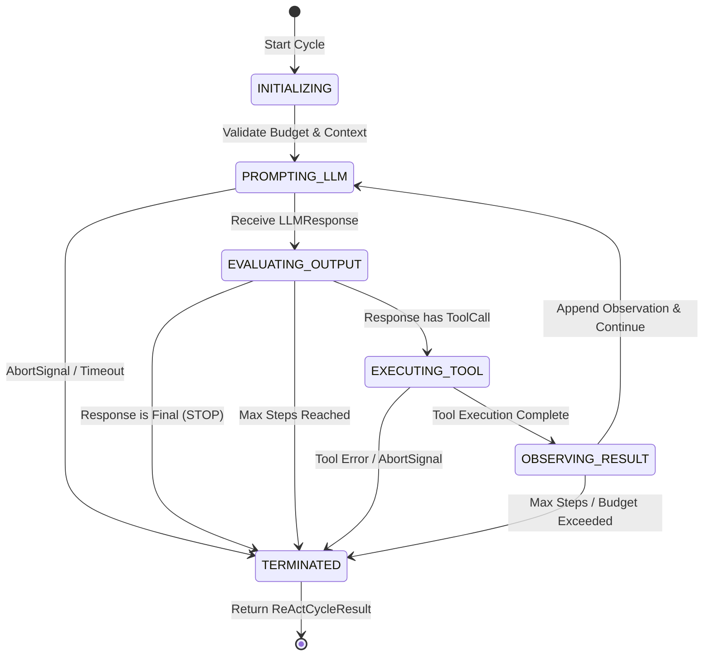

# ADR-019: Deterministic ReAct Reasoning State Machine

- **Status**: Proposed
- **Date**: July 30, 2026
- **Authors**: Principal Software Architect & Core AI Engineering Team
- **Capability**: `capability-027` (Iteration 3)
- **Category**: `[REASONING]` ReAct State Machine & Reasoning Boundary

---

## Context & Problem Statement

In Capability-027 Iteration 3, the AI Agent platform requires an explicit, deterministic **ReAct Reasoning Engine**.

Without a deterministic state machine boundary:

1. LLMs running in free-form loops risk infinite tool execution cycles, uncontrolled prompt expansion, or unhandled recursion timeouts.
2. The boundaries between High-Level Planning (Capability-028), Tool Execution (Iteration 2 `ToolDispatcher`), Working Memory (Capability-025), and Reasoning State become blurred.
3. Cancellation (`AbortSignal`), timeouts, and max-step execution budgets cannot be deterministically enforced.

---

## Decision Drivers

1. **State Machine Controls Reasoning**: The **Reasoning State Machine** governs the execution loop. The LLM produces completion outputs and tool call declarations, but the State Machine strictly evaluates transition rules, step limits, and termination criteria.
2. **Explicit Separation of Concerns**:
   - **Planner** (Capability-028): Generates high-level sub-goals/steps.
   - **Reasoning Engine** (Iteration 3): Evaluates current step, selects tool / processes LLM output, and produces `ReasoningStep`.
   - **Tool Dispatcher** (Iteration 2): Dispatches matched `ToolInvocation` VOs (Zero selection logic).
   - **Working Memory** (Capability-025): Stores ephemeral `Observation` records.
   - **Conversation State** (Capability-024): Tracks user dialogue state.
3. **Deterministic State Machine Diagram**:
   - `INITIALIZING` -> `PROMPTING_LLM` -> `EVALUATING_OUTPUT` -> `EXECUTING_TOOL` -> `OBSERVING_RESULT` -> `TERMINATED`.
4. **Deep Immutability & Immutable Observations**: `ReasoningState` and `Observation` VOs are deeply immutable (`Object.freeze`).
5. **Strict Termination Conditions**: The reasoning cycle terminates _only_ under 5 explicit conditions (`ReasoningFinishReason`):
   - `STOP`: LLM produced a final response without tool calls.
   - `MAX_STEPS`: Reached `ExecutionBudgetPolicy.maxSteps`.
   - `TIMEOUT`: Exceeded `ExecutionBudgetPolicy.maxDurationMs` or `ClockPort` deadline.
   - `UNHANDLED_ERROR`: Caught a non-recoverable error.
   - `CANCELLED`: Interrupted via `AbortSignal`.

---

## State Machine Diagram & Transition Rules



### Transition Matrix

| Current State       | Event / Trigger           | Next State          | Guard / Action                                                |
| ------------------- | ------------------------- | ------------------- | ------------------------------------------------------------- |
| `INITIALIZING`      | `start()`                 | `PROMPTING_LLM`     | Initialize budget, assemble system prompts & context snapshot |
| `PROMPTING_LLM`     | `onResponse(llmResponse)` | `EVALUATING_OUTPUT` | Parse primary choice, check finish reason                     |
| `PROMPTING_LLM`     | `onAbort() / onTimeout()` | `TERMINATED`        | Set `finishReason = CANCELLED \| TIMEOUT`                     |
| `EVALUATING_OUTPUT` | Tool Call Present         | `EXECUTING_TOOL`    | Create `ToolInvocation` VO, increment step count              |
| `EVALUATING_OUTPUT` | No Tool Call (Text Only)  | `TERMINATED`        | Set `finishReason = STOP`, return final assistant response    |
| `EVALUATING_OUTPUT` | Step Count >= MaxSteps    | `TERMINATED`        | Set `finishReason = MAX_STEPS`                                |
| `EXECUTING_TOOL`    | `ToolResult` returned     | `OBSERVING_RESULT`  | Construct immutable `Observation` VO                          |
| `EXECUTING_TOOL`    | Unhandled Error           | `TERMINATED`        | Set `finishReason = UNHANDLED_ERROR`                          |
| `OBSERVING_RESULT`  | Budget Valid              | `PROMPTING_LLM`     | Append observation to message chain, re-prompt                |
| `OBSERVING_RESULT`  | Budget Exceeded           | `TERMINATED`        | Set `finishReason = MAX_STEPS \| TIMEOUT`                     |

---

## Proposed Domain Models & Port Contracts for Iteration 3

### 1. Value Objects & Entities

- **`ReasoningStep`**: Value Object containing `{ stepIndex: number, state: ReasoningStateType, action?: ToolInvocation, observation?: Observation, timestamp: Instant }`.
- **`Observation`**: Value Object containing `{ observationId: string, toolId: ToolId, invocationId: InvocationId, status: 'success' | 'failure', output: string, executionTimeMs: number, timestamp: Instant }`.
- **`ReasoningFinishReason`**: `'STOP' | 'MAX_STEPS' | 'TIMEOUT' | 'UNHANDLED_ERROR' | 'CANCELLED'`.
- **`ReActCycleResult`**: Value Object containing `{ cycleId: string, finishReason: ReasoningFinishReason, finalResponse?: LLMResponse, steps: ReadonlyArray<ReasoningStep>, observations: ReadonlyArray<Observation>, totalDurationMs: number }`.

### 2. Application Ports

- **`ReasoningEnginePort`**:
  ```typescript
  export interface ReasoningEnginePort {
    executeCycle(
      tenantContext: Readonly<TenantContext>,
      request: Readonly<LLMRequest>,
      budgetPolicy: Readonly<ExecutionBudgetPolicy>,
      options?: Readonly<{ signal?: AbortSignal }>,
    ): Promise<ReActCycleResult>;
  }
  ```

---

## Non-Goals (Explicitly Out of Scope for Reasoning Engine)

- ❌ **Direct Tool Invocation**: Reasoning Engine does NOT execute tool code directly; it delegates exclusively to `ToolDispatcherPort` (Iteration 2).
- ❌ **High-Level Goal Planning**: Reasoning Engine does NOT break multi-day user goals into sub-plans; high-level goal decomposition is owned by `Planner` (Capability-028).
- ❌ **Direct Database Reads**: Does NOT directly query database storage; consumes `ContextSnapshot` (Capability-026) and `WorkingMemoryPort` (Capability-025).

---

## Compliance & Verification

- **ADR-009 / ADR-010**: Pure domain VOs, zero infrastructure coupling.
- **ADR-018 Alignment**: Respects immutable `ToolDispatcherPort` and raw `ToolResult` decoupling.
- **Contract Tests**: Verified by `react-reasoning.contract.test.ts`.
