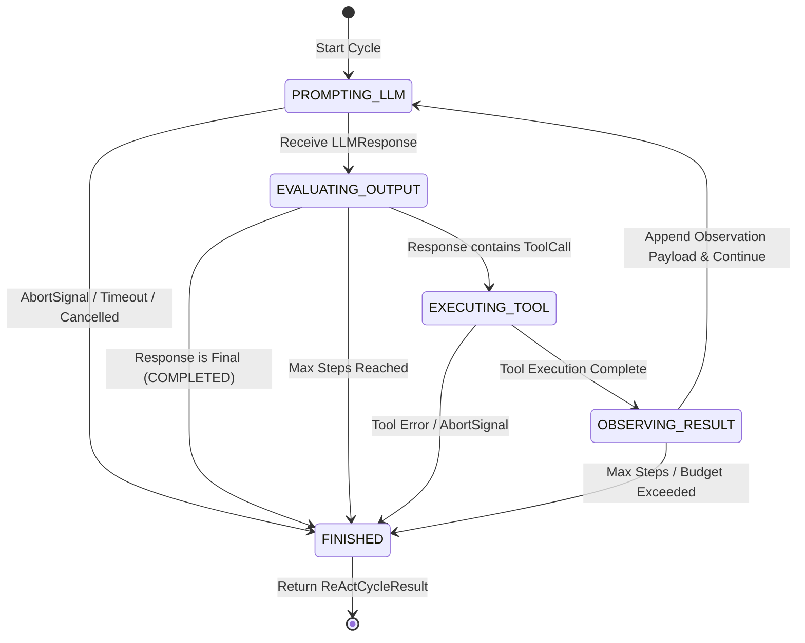
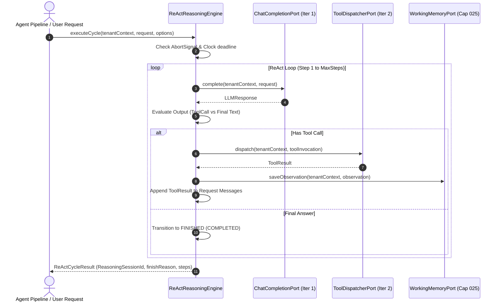

# ADR-019: Deterministic ReAct Reasoning State Machine

- **Status**: Accepted
- **Date**: July 30, 2026
- **Authors**: Principal Software Architect & Core AI Engineering Team
- **Capability**: `capability-027` (Iteration 3)
- **Category**: `[REASONING]` ReAct State Machine & Reasoning Boundary

---

## Context & Problem Statement

In Capability-027 Iteration 3, the AI Agent platform requires an explicit, deterministic **ReAct Reasoning Engine**.

Without a deterministic state machine boundary:

1. LLMs running in free-form loops risk infinite tool execution cycles, uncontrolled prompt expansion, or unhandled recursion timeouts.
2. The boundaries between High-Level Planning (Capability-028), Tool Execution (Iteration 2 `ToolDispatcher`), Working Memory (Capability-025), and Reasoning State become blurred.
3. Coupling steps directly to concrete `ToolInvocation` objects prevents future actions (e.g. `FinishAction`, `ReflectionAction`, `UserInquiryAction`).
4. Squeezing tool observations into raw strings creates future transport bottlenecks for multimodal payloads.

---

## Decision Drivers

1. **State Machine Controls Reasoning**: The **Reasoning State Machine** governs the execution loop. The LLM produces completion outputs and tool call declarations, but the State Machine strictly evaluates transition rules, step budgets, deadlines, and termination criteria.
2. **Constructor Injection of Policy & Clock**: `ExecutionBudgetPolicy`, `ClockPort`, and `ToolDispatcherPort` are injected into `ReActReasoningEngine` via constructor injection, keeping `executeCycle()` clean and focused on request execution.
3. **Extensible `ReasoningAction` Hierarchy**: Actions are modeled as an extensible discriminated union (`ToolInvocationAction | FinishAction | ResponseAction | ReflectionAction`).
4. **Structured `ObservationPayload` VO**: Observation data is encapsulated inside `ObservationPayload` (`TextObservationPayload`), preventing string lock-in for future multimodal outputs.
5. **Single Source of Truth for Steps & Observations**: `ReActCycleResult` contains a single immutable list of `steps: ReadonlyArray<ReasoningStep>`. Each step links to its own `observation?: Observation`.
6. **Explicit State Machine States**:
   - `PROMPTING_LLM` -> `EVALUATING_OUTPUT` -> `EXECUTING_TOOL` -> `OBSERVING_RESULT` -> `FINISHED`.
7. **Strict Finish Reasons**: The reasoning cycle finishes _only_ under 5 explicit conditions (`ReasoningFinishReason`):
   - `COMPLETED`: LLM produced a final response without tool calls.
   - `MAX_STEPS`: Reached `ExecutionBudgetPolicy.maxSteps`.
   - `TIMEOUT`: Exceeded `ExecutionBudgetPolicy.maxDurationMs` or `ClockPort` deadline.
   - `UNHANDLED_ERROR`: Caught a non-recoverable runtime exception.
   - `CANCELLED`: Interrupted via `AbortSignal`.

---

## State Machine Diagram & Transition Matrix

### State Diagram



### Transition Matrix

| Current State       | Event / Trigger           | Next State          | Guard / Action                                                  |
| ------------------- | ------------------------- | ------------------- | --------------------------------------------------------------- |
| `PROMPTING_LLM`     | `onResponse(llmResponse)` | `EVALUATING_OUTPUT` | Parse primary choice, evaluate action intent                    |
| `PROMPTING_LLM`     | `onAbort() / onTimeout()` | `FINISHED`          | Set `finishReason = CANCELLED \| TIMEOUT`                       |
| `EVALUATING_OUTPUT` | Tool Call Present         | `EXECUTING_TOOL`    | Create `ToolInvocationAction` VO, increment step index          |
| `EVALUATING_OUTPUT` | Text Only (No Tool)       | `FINISHED`          | Create `FinishAction` VO, set `finishReason = COMPLETED`        |
| `EVALUATING_OUTPUT` | Step Index >= MaxSteps    | `FINISHED`          | Set `finishReason = MAX_STEPS`                                  |
| `EXECUTING_TOOL`    | `ToolResult` returned     | `OBSERVING_RESULT`  | Construct immutable `TextObservationPayload` & `Observation` VO |
| `EXECUTING_TOOL`    | Unhandled Exception       | `FINISHED`          | Set `finishReason = UNHANDLED_ERROR`                            |
| `OBSERVING_RESULT`  | Budget Valid              | `PROMPTING_LLM`     | Append step observation to message history, re-prompt           |
| `OBSERVING_RESULT`  | Budget Exceeded           | `FINISHED`          | Set `finishReason = MAX_STEPS \| TIMEOUT`                       |

---

## ReAct Engine Lifecycle Sequence Diagram



---

## Proposed Value Objects & Port Contracts

### 1. Action & Payload Hierarchy

- **`ReasoningAction`**: Discriminated union (`ToolInvocationAction | FinishAction | ResponseAction | ReflectionAction`).
  - `ToolInvocationAction`: `{ type: 'tool_invocation', invocation: ToolInvocation }`.
  - `FinishAction`: `{ type: 'finish', finalResponse: LLMResponse }`.
- **`ObservationPayload`**: Discriminated union (`TextObservationPayload`).
  - `TextObservationPayload`: `{ type: 'text', content: string }`.
- **`Observation`**: Value Object containing `{ observationId: string, toolId: ToolId, invocationId: InvocationId, payload: ObservationPayload, executionTimeMs: number, timestamp: Instant }`.
- **`ReasoningStep`**: Value Object containing `{ stepIndex: number, state: ReasoningStateType, action: ReasoningAction, observation?: Observation, timestamp: Instant }`.
- **`ReasoningSessionId`**: Nominal brand string alias (`Brand<string, 'ReasoningSessionId'>`).
- **`ReasoningFinishReason`**: `'COMPLETED' | 'MAX_STEPS' | 'TIMEOUT' | 'UNHANDLED_ERROR' | 'CANCELLED'`.
- **`ReActCycleResult`**: Value Object containing `{ sessionId: ReasoningSessionId, finishReason: ReasoningFinishReason, finalResponse?: LLMResponse, steps: ReadonlyArray<ReasoningStep>, totalDurationMs: number }`.

### 2. Application Port

- **`ReasoningEnginePort`**:
  ```typescript
  export interface ReasoningEnginePort {
    executeCycle(
      tenantContext: Readonly<TenantContext>,
      request: Readonly<LLMRequest>,
      options?: Readonly<{ signal?: AbortSignal }>,
    ): Promise<ReActCycleResult>;
  }
  ```

---

## Consequences

### Positive

- **Extensible Action Hierarchy**: Future actions (e.g. `ReflectionAction`, `UserInquiryAction`) add new discriminated union members without breaking `ReasoningStep`.
- **Multimodal Payload Ready**: `ObservationPayload` prevents string lock-in for future image/audio tool outputs.
- **Clean IoC Injection**: `ExecutionBudgetPolicy` and `ClockPort` are injected via constructor, keeping `executeCycle()` clean and predictable.

---

## Compliance & Verification

- **ADR-009 / ADR-010**: Pure domain VOs, 0 infrastructure coupling.
- **ADR-018 Alignment**: Respects immutable `ToolDispatcherPort` and raw `ToolResult` decoupling.
- **Contract Tests**: Verified by `react-reasoning.contract.test.ts`.
