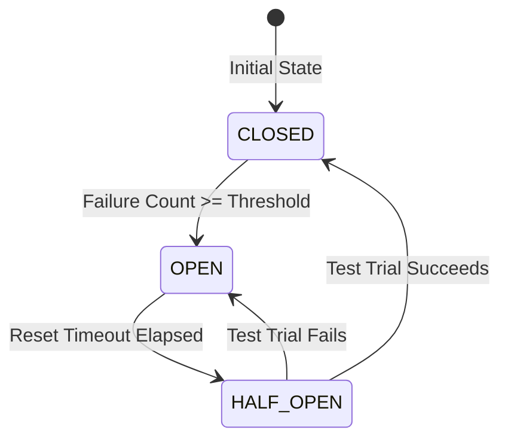

# ADR-020: Resilient Execution Decorators & Timeout Hierarchy

- **Status**: Accepted
- **Date**: July 30, 2026
- **Authors**: Principal Software Architect & Core AI Engineering Team
- **Capability**: `capability-027` (Iteration 4)
- **Category**: `[RESILIENCE]` Decorator Policies & Execution Hardening

---

## Context & Problem Statement

In Capability-027 Iteration 4, the AI Agent platform requires transparent **Application Resilience** (retry logic and circuit breaking).

Without non-intrusive decorator boundaries:

1. Blindly retrying errors can retry non-idempotent or non-transient failures (e.g. `ValidationErrors`, `ToolValidationError`, Auth failures, 400 Bad Request).
2. Hardcoding retry rules inside decorators prevents policy customization across different providers and tools.
3. Unclear Circuit Breaker scope (adapter-wide vs. tool-wide) leads to unpredictable isolation boundaries.
4. Coupling decorators to domain parsers (`ReasoningAction`) leaks layer abstractions.

---

## Decision Drivers

1. **Non-Intrusive Decorator Pattern**: Retries and circuit breaking are implemented strictly via Decorator wrapping:
   - `ChatCompletionPort` -> `RetryChatCompletionDecorator` -> `OpenAiChatCompletionAdapter`.
   - `ToolExecutionPort` -> `CircuitBreakerToolDecorator` -> `InMemoryToolExecutionAdapter`.
2. **Explicit `RetryDecisionPolicy` Abstraction**: Retries are evaluated by `RetryDecisionPolicy.shouldRetry(error, attempt)`:
   - **Retryable Errors**: Timeout, Connection Reset, HTTP 429 (Rate Limit), HTTP 502 (Bad Gateway), HTTP 503 (Service Unavailable), HTTP 504 (Gateway Timeout).
   - **Non-Retryable Errors**: `ToolValidationError`, `ValidationError`, Authentication/Authorization failures (HTTP 401/403), Malformed Request (HTTP 400), Domain Errors.
3. **Adapter Instance Circuit Breaker Scope**: Circuit Breaker state is scoped **per Adapter Instance** (In-Memory).
4. **Half-Open Circuit Breaker Lifecycle**:
   - `CLOSED` --(failures >= threshold)--> `OPEN` --(resetTimeoutMs elapsed)--> `HALF_OPEN` --(1 test trial success)--> `CLOSED` (or trial failure -> `OPEN`).
5. **Pure & Immutable Policies**:
   - `RetryPolicy`: Immutable VO containing `{ maxAttempts: number, backoff: BackoffPolicy, decisionPolicy: RetryDecisionPolicy }`.
   - `BackoffPolicy`: Pure strategy returning `getDelayMs(attempt: number): number` (zero side-effects).
6. **Strict Timeout Hierarchy**:
   - `Reasoning Cycle Timeout` (Outer limit, e.g. 60,000ms — enforced by `ReasoningLoopGuard`).
   - `LLM Completion Timeout` (Per-LLM call limit, e.g. 15,000ms — enforced by `ChatCompletionOptions.timeoutMs`).
   - `Tool Execution Timeout` (Per-tool limit, e.g. 5,000ms — enforced by `ToolExecutionOptions.timeoutMs`).
7. **Protected Extension Hooks**: Decorators include lifecycle hook methods (`onRetry()`, `onCircuitOpened()`, `onCircuitClosed()`) for future telemetry integration.

---

## State Diagram — Circuit Breaker Lifecycle



---

## Timeout Hierarchy Diagram

```text
[Reasoning Loop Execution - Outer Limit e.g. 60s]
  │
  ├── Step 1: Prompt LLM [Chat Completion Timeout e.g. 15s]
  │     ├── Attempt 1 (Fails: HTTP 503)
  │     ├── Backoff Delay (e.g. 100ms)
  │     └── Attempt 2 (Succeeds)
  │
  └── Step 2: Execute Tool [Tool Execution Timeout e.g. 5s]
        └── Attempt 1 (Succeeds)
```

---

## Fixed Decorator Ordering in Composition Root

```text
Chat Completion Pipeline:
ChatCompletionPort -> RetryChatCompletionDecorator -> [Future Metrics] -> [Future Logging] -> OpenAiChatCompletionAdapter

Tool Execution Pipeline:
ToolExecutionPort -> CircuitBreakerToolDecorator -> [Future Metrics] -> [Future Logging] -> ConcreteToolAdapter
```

---

## Proposed Component Layout for Iteration 4

### 1. Value Objects & Policy Interfaces (`src/application/agent/vo/` & `policy/`)

- **`BackoffPolicy`**: Interface returning `getDelayMs(attempt: number): number`.
  - `ConstantBackoff`: `{ delayMs: number }`.
  - `ExponentialBackoff`: `{ initialDelayMs: number, multiplier: number, maxDelayMs: number }`.
- **`RetryDecisionPolicy`**: Interface `shouldRetry(error: unknown, attempt: number): boolean`.
  - `TransientErrorRetryDecisionPolicy`: Evaluates HTTP status codes and transient runtime errors.
- **`RetryPolicy`**: Value Object combining `{ maxAttempts: number, backoff: BackoffPolicy, decisionPolicy: RetryDecisionPolicy }`.
- **`CircuitBreakerPolicy`**: Value Object combining `{ failureThreshold: number, resetTimeoutMs: number }`.

### 2. Application Decorators (`src/application/agent/decorators/`)

- **`RetryChatCompletionDecorator`**: Implements `ChatCompletionPort` with transient error retries.
- **`CircuitBreakerToolDecorator`**: Implements `ToolExecutionPort` with in-memory adapter circuit breaking.

---

## Future Evolution (Out of Scope for Iteration 4)

In future iterations, as policies expand, individual policies may be unified under a composite `ResiliencePolicy`:

```text
ResiliencePolicy
├── RetryPolicy
├── TimeoutPolicy
└── CircuitBreakerPolicy
```

---

## Compliance & Verification

- **ADR-009 / ADR-010**: Pure domain VOs, 0 framework dependencies.
- **ADR-018 / ADR-019**: Preserves immutable dispatchers and deterministic state machine boundaries.
- **Contract Tests**: Verified by `resilience-decorators.contract.test.ts`.
