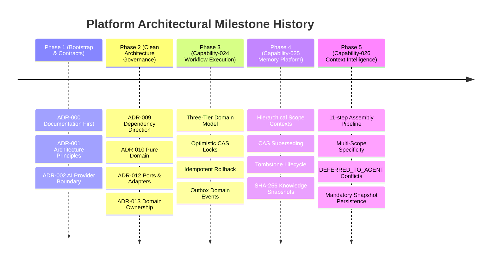

# Architecture Decision Timeline

## Architectural Decision Log

This document provides a chronological timeline of all major architectural decisions across the platform's capability evolution.

---

## Decision Timeline

| Date / Phase | Capability       | Category  | Decision                                      | ADR                                                                                                                              | Status   | Impact Summary                                                             |
| ------------ | ---------------- | --------- | --------------------------------------------- | -------------------------------------------------------------------------------------------------------------------------------- | -------- | -------------------------------------------------------------------------- |
| Phase 1      | `capability-001` | `[GOV]`   | **Documentation First**                       | [ADR-000](file:///Users/tarikozbalkan/www/LI-KITCHEN/.ai/handbook/adr/ADR-000-documentation-first.md)                            | Accepted | Documentation must precede or accompany implementation.                    |
| Phase 1      | Foundation       | `[ARCH]`  | **Architecture Principles**                   | [ADR-001](file:///Users/tarikozbalkan/www/LI-KITCHEN/.ai/handbook/adr/ADR-001-architecture-principles.md)                        | Accepted | Pure domain core, zero infrastructure leakage.                             |
| Phase 1      | Foundation       | `[AI]`    | **AI Provider Separation**                    | [ADR-002](file:///Users/tarikozbalkan/www/LI-KITCHEN/.ai/handbook/adr/ADR-002-ai-separation.md)                                  | Accepted | AI logic decoupled from transport/presentation layers.                     |
| Phase 2      | `capability-003` | `[DDD]`   | **Conversation Contract**                     | [ADR-003](file:///Users/tarikozbalkan/www/LI-KITCHEN/.ai/handbook/adr/ADR-003-conversation-contract.md)                          | Accepted | Standardized facts & state machine boundaries.                             |
| Phase 2      | `capability-005` | `[DDD]`   | **Recommendation Engine**                     | [ADR-004](file:///Users/tarikozbalkan/www/LI-KITCHEN/.ai/handbook/adr/ADR-004-recommendation-engine.md)                          | Accepted | Pure confidence and readiness scoring engine.                              |
| Phase 2      | `capability-009` | `[AI]`    | **AI Output Validation**                      | [ADR-005](file:///Users/tarikozbalkan/www/LI-KITCHEN/.ai/handbook/adr/ADR-005-ai-output-validation.md)                           | Accepted | Zod-based schema validation at transport boundary.                         |
| Phase 2      | `capability-009` | `[AI]`    | **External Provider Boundary**                | [ADR-006](file:///Users/tarikozbalkan/www/LI-KITCHEN/.ai/handbook/adr/ADR-006-external-provider-boundary.md)                     | Accepted | Provider circuit breakers, rate limiters, fallback chains.                 |
| Phase 3      | Framework        | `[ARCH]`  | **Clean Architecture & Dependency Direction** | [ADR-009](file:///Users/tarikozbalkan/www/LI-KITCHEN/.ai/handbook/adr/ADR-009-dependency-direction.md)                           | Accepted | `Shared → Domain → Application → Infrastructure → App`.                    |
| Phase 3      | Framework        | `[DDD]`   | **Pure Domain Rules**                         | [ADR-010](file:///Users/tarikozbalkan/www/LI-KITCHEN/.ai/handbook/adr/ADR-010-pure-domain-rules.md)                              | Accepted | Domain model owns business logic; no external dependencies.                |
| Phase 3      | Framework        | `[ARCH]`  | **Ports & Adapters Policy**                   | [ADR-012](file:///Users/tarikozbalkan/www/LI-KITCHEN/.ai/handbook/adr/ADR-012-ports-and-adapters-policy.md)                      | Accepted | Hexagonal boundaries; application depends only on ports.                   |
| Phase 3      | Framework        | `[DDD]`   | **Domain Model Ownership**                    | [ADR-013](file:///Users/tarikozbalkan/www/LI-KITCHEN/.ai/handbook/adr/ADR-013-domain-model-ownership.md)                         | Accepted | Pure TypeScript interfaces; validation schemas never define domain.        |
| Phase 4      | `capability-024` | `[EVENT]` | **Reliable Domain Event Delivery**            | [ADR-0014](file:///Users/tarikozbalkan/www/LI-KITCHEN/docs/architecture/decisions/0014-reliable-domain-event-delivery.md)        | Accepted | Outbox pattern for asynchronous domain event publishing.                   |
| Phase 5      | `capability-026` | `[CTX]`   | **Context Assembly Boundary**                 | [ADR-014](file:///Users/tarikozbalkan/www/LI-KITCHEN/.ai/handbook/adr/ADR-014-context-assembly-boundary.md)                      | Accepted | 026 is a composition layer; does not own retrieval or memory lifecycle.    |
| Phase 5      | `capability-026` | `[SEC]`   | **Authorization Preservation**                | [ADR-015](file:///Users/tarikozbalkan/www/LI-KITCHEN/.ai/handbook/adr/ADR-015-authorization-preservation-in-context-assembly.md) | Accepted | `ContextAssembler` never directly accesses raw memory/knowledge repos.     |
| Phase 5      | `capability-026` | `[CTX]`   | **Deterministic Context Selection**           | [ADR-016](file:///Users/tarikozbalkan/www/LI-KITCHEN/.ai/handbook/adr/ADR-016-deterministic-context-selection.md)                | Accepted | Static priority, DEFERRED_TO_AGENT conflicts, mandatory SHA-256 snapshots. |

---

## Architectural Milestones

---

## Governance Rules for Future ADRs

1. **Sequential Numbering**: New ADRs must continue sequentially from **ADR-017** in `.ai/handbook/adr/`.
2. **Immutability**: Accepted ADRs are immutable. If a decision changes, create a new ADR referencing the superseded one.
3. **Cross-Referencing**: Walkthrough documentation and capability metadata YAML files must reference relevant ADRs.
