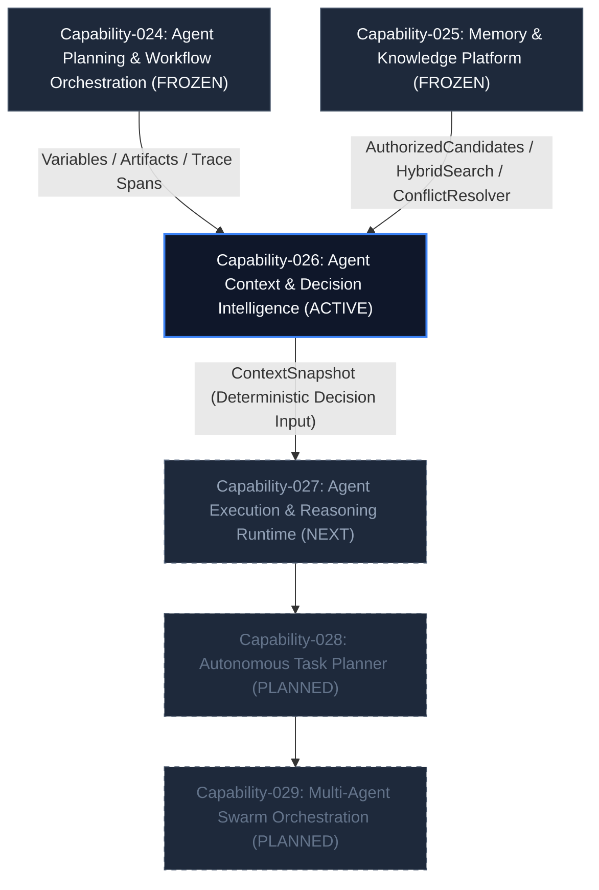
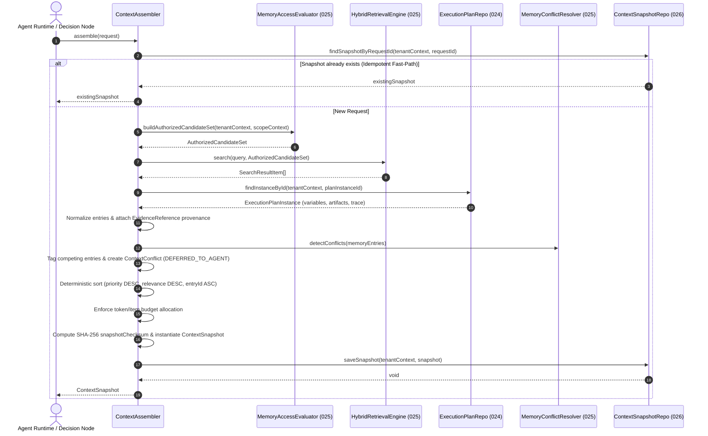

# Capability-026 Walkthrough: Agent Context & Decision Intelligence

## 1. Architecture Status & Lifecycle

### Capability Lifecycle

| Lifecycle Stage            | Status     | Notes                                                     |
| -------------------------- | ---------- | --------------------------------------------------------- |
| **1. Planning**            | ✔ Complete | Scope, domain model, and 11-step pipeline designed        |
| **2. Implementation**      | ✔ Complete | 13 new files created, 1 modified, 0 changes to 024/025    |
| **3. Architecture Review** | ✔ Approved | Zero-architecture defect sign-off                         |
| **4. P0 Security Review**  | ✔ Passed   | Tenant isolation, authorization-before-retrieval verified |
| **5. P1 Quality Review**   | ✔ Passed   | Deterministic checksums, DEFERRED_TO_AGENT verified       |
| **6. Production Ready**    | ✔ Approved | 16 contract tests, 220 suite tests, 0 lint/type errors    |
| **7. Frozen Baseline**     | Active     | Unfrozen active baseline for Capability-027               |

### Status Summary

| Property                   | Value                                                                                                  |
| -------------------------- | ------------------------------------------------------------------------------------------------------ |
| **Capability ID**          | `capability-026`                                                                                       |
| **Name**                   | Agent Context & Decision Intelligence                                                                  |
| **Status**                 | Production Ready                                                                                       |
| **Frozen Status**          | No (Active baseline for Capability-027)                                                                |
| **Owner**                  | `application-context-intelligence`                                                                     |
| **Depends On**             | Capability-024 (Agent Planning & Workflow Orchestration), Capability-025 (Memory & Knowledge Platform) |
| **Consumed By**            | Capability-027 (Agent Execution & Tool Invocation Runtime)                                             |
| **Breaking Changes**       | None                                                                                                   |
| **Backward Compatibility** | Fully compatible (zero changes to 024/025)                                                             |

---

## 2. Problem Statement

Prior to Capability-026, workflow execution (Capability-024) and memory/knowledge retrieval (Capability-025) operated independently. There was no deterministic, auditable, or authorization-preserving mechanism to compose runtime state (variables, artifacts, trace history) together with authorized long-term memory and external knowledge documents into a single, bounded context for an agent before making a decision.

Without Capability-026:

- Agent components had to ad-hoc fetch memories and variables, risking cross-tenant or cross-workspace leaks.
- Conflicting information (e.g. contradictory memory facts vs. workflow variables) was either silently overwritten or lost.
- There was no immutable record of "what exact context the agent saw" when it made a specific decision, preventing auditability and offline replay.

---

## 3. Design Goals

- **Deterministic Context Assembly**: Identical inputs and identical source states always produce identical context ordering and checksums.
- **Authorization-Preserving**: Authorization is structurally enforced _before_ retrieval. Raw repositories are never queried directly by the assembly layer.
- **Full Provenance & Traceability**: Every context entry carries an explicit, non-null `EvidenceReference` linking back to its exact source, version, checksum, and confidence score.
- **DEFERRED_TO_AGENT Conflict Handling**: Semantic conflicts are detected and preserved without silent data loss. Reasoning belongs to the agent.
- **Immutable Snapshots**: Every successful assembly produces a frozen `ContextSnapshot` with a canonical SHA-256 checksum for audit and replay.
- **Multi-Scope Hierarchy**: Supports combinable scopes (`PLAN_INSTANCE > USER > WORKSPACE > ORGANIZATION > TENANT`) with strict specificity precedence.
- **Zero Modifications to Frozen Capabilities**: Capability-024 (`commit 4bade7b`) and Capability-025 (`commit 80781dc`) remain 100% frozen and unmodified.

---

## 4. Non-Goals

Capability-026 is strictly a **context composition layer**. It is **NOT** responsible for:

- **RAG Reranking / Vector Indexing**: Owned by Capability-025's retrieval engine.
- **Embedding Generation**: Owned by Capability-025 infrastructure adapters.
- **LLM Prompting & Inference**: Owned by `ChatCompletionPort` and agent runtime adapters.
- **Memory Persistence & Lifecycle**: Owned by Capability-025 (`MemoryRecord`, `KnowledgeDocument`).
- **Workflow Execution**: Owned by Capability-024 (`ExecutionScheduler`, `ExecutionDispatcher`).

---

## 5. Capability Dependency & Platform Evolution Graph

---

## 6. Alternatives Considered ("Why Not?")

| Alternative                                                                                           | Rationale for Rejection                                                                                                                                                                                                             |
| ----------------------------------------------------------------------------------------------------- | ----------------------------------------------------------------------------------------------------------------------------------------------------------------------------------------------------------------------------------- |
| **Option A: Repository-First Assembly** _(Query raw Memory/Knowledge repos directly)_              | **Rejected**. High risk of authorization leakage, duplicates retrieval algorithms, and violates Capability-025's domain boundary. Structurally prevented by requiring `MemoryAccessEvaluator` in `ContextAssembler`'s constructor.  |
| **Option B: LLM-Based Conflict Resolution** _(Ask LLM to resolve competing facts during assembly)_ | **Rejected**. Non-deterministic, introduces non-reproducible latency and cost, breaks offline replayability, and destroys competing evidence before audit. Assembly must prepare evidence; LLM reasoning belongs in Capability-027. |
| **Option C: Mutable Snapshots** _(Update existing snapshot when context changes)_                  | **Rejected**. Invalidates canonical SHA-256 checksums, breaks audit trails, and prevents historical replay ("What did the agent see at time $T$?"). Snapshots are strictly immutable; updates produce new snapshots.                |

---

## 7. Architecture & Pipeline Flow

### 11-Step Deterministic Pipeline

1. **Validate Request**: Validate `ContextAssemblyRequest` parameters, tenant IDs, and scope requirements.
2. **Establish Scope Boundaries**: Build `MemoryScopeContext` for each permitted scope (`PLAN_INSTANCE`, `WORKSPACE`, etc.).
3. **Authorization Evaluation**: Query Capability-025 `MemoryAccessEvaluator.buildAuthorizedCandidateSet()` for permitted scopes.
4. **Authorized Retrieval**: Perform hybrid search via `HybridRetrievalEngine.search()` on authorized candidates only.
5. **Gather Execution State**: Read variables, artifacts, trace history, and system context from Capability-024's `ExecutionPlanInstance` (read-only).
6. **Normalize to ContextEntries**: Map all sources to `ContextEntry` VOs with mandatory `EvidenceReference` provenance.
7. **Detect Semantic Conflicts**: Identify key collisions across memory/knowledge/variables; tag competing entries.
8. **Apply Deterministic Priority**: Compute combined priority: `(scopeSpecificity * 10000) + (sourcePriority * 1000) + Math.round(relevanceScore * 100)`.
9. **Budget Enforcement**: Greedy allocation in priority order up to `tokenBudget` and `maxItems` ceilings.
10. **Create Immutable ContextSnapshot**: Compute canonical SHA-256 checksum over request, entries, and conflicts.
11. **Mandatory Snapshot Persistence**: Save `ContextSnapshot` to tenant-partitioned `ContextSnapshotRepositoryPort`.

---

## 8. Failure Modes & Degradation Matrix

| Failure Scenario                   | Component Impact                                      | System Behavior / Recovery                                                                                                                        |
| ---------------------------------- | ----------------------------------------------------- | ------------------------------------------------------------------------------------------------------------------------------------------------- |
| **Memory Repository Down / Empty** | Capability-025 candidates missing                     | **Graceful Degradation**. Context assembled with knowledge documents, execution state, and system context. `candidateCounts` logged in trace.     |
| **Execution Instance Missing**     | Capability-024 instance undefined                     | **Graceful Degradation**. Assembly succeeds with memory, knowledge, and system context. Variables/artifacts/spans omitted without crashing.       |
| **Snapshot Persistence Fails**     | `ContextSnapshotRepositoryPort.saveSnapshot()` throws | **Atomic Fail-Fast**. The assembly operation fails completely. No un-persisted context is returned to the caller, guaranteeing 100% auditability. |
| **Token / Item Budget Exceeded**   | Low-priority entries exceed limit                     | **Deterministic Truncation**. Entries allocated greedily in priority order. Excess items discarded; `utilization.budgetExhausted` set to `true`.  |
| **Cross-Tenant Request Attempt**   | Tenant ID mismatch in request/scope                   | **Security Violation Error**. Immediately throws cross-tenant security error before any data read occurs.                                         |

---

## 9. Domain Model & Complexity Metrics

### Architectural Stability Metrics

| Metric                      | Value | Note                                                                                                                                                                |
| --------------------------- | ----- | ------------------------------------------------------------------------------------------------------------------------------------------------------------------- |
| **Public Ports**            | 2     | `ContextSnapshotRepositoryPort`, `ContextTokenEstimatorPort`                                                                                                        |
| **Aggregate Roots**         | 1     | `ContextSnapshot`                                                                                                                                                   |
| **Value Objects**           | 6     | `ContextAssemblyRequest`, `ContextEntry`, `EvidenceReference`, `ContextConflict`, `ContextAssemblyTrace`, `SourceUtilization`                                       |
| **Application Services**    | 1     | `ContextAssembler`                                                                                                                                                  |
| **Infrastructure Adapters** | 2     | `InMemoryContextSnapshotAdapter`, `CharacterBasedTokenEstimator`                                                                                                    |
| **Contract Tests**          | 16    | [`context-intelligence.contract.test.ts`](file:///Users/tarikozbalkan/www/LI-KITCHEN/src/infrastructure/context-intelligence/context-intelligence.contract.test.ts) |
| **External Dependencies**   | 0     | Pure Node.js `crypto` + internal clean interfaces                                                                                                                   |
| **Frozen Dependencies**     | 2     | Capability-024 (`commit 4bade7b`), Capability-025 (`commit 80781dc`)                                                                                                |
| **Breaking Changes**        | 0     | Fully backward compatible                                                                                                                                           |

---

## 10. Sequence Diagram

---

## 11. Why These Decisions? (Design Rationale)

### Why `DEFERRED_TO_AGENT` Conflict Resolution?

**Reason**: Context assembly must never silently destroy or suppress conflicting information. The assembly layer's role is to prepare evidence, not to reason about business domain contradictions. Silently selecting a "winner" at assembly time would hide competing evidence from the LLM or agent, leading to unpredictable decisions that cannot be debugged.

### Why Static Source Priority Order (`SYSTEM_CONTEXT > VARIABLE > ARTIFACT > EXECUTION_TRACE > MEMORY > KNOWLEDGE`)?

**Reason**: System rules (`SYSTEM_CONTEXT`) are non-negotiable. Active execution variables (`VARIABLE`) and node outputs (`ARTIFACT`) represent the immediate state of the current workflow instance. Execution history (`EXECUTION_TRACE`) provides operational context. Long-term learned memories (`MEMORY`) and external documents (`KNOWLEDGE`) provide background context. Ordering this statically ensures deterministic precedence when sorting under budget limits.

### Why Multi-Scope Hierarchy (`PLAN_INSTANCE > USER > WORKSPACE > ORGANIZATION > TENANT`)?

**Reason**: Scope specificity dictates relevance. A variable or memory specific to the current `PLAN_INSTANCE` is more relevant to the immediate decision than a general `WORKSPACE` rule. Giving higher specificity a numeric boost (`PLAN_INSTANCE: 50000`, `WORKSPACE: 30000`, etc.) guarantees that instance-specific context is preferred under token budget constraints.

### Why Mandatory Immutable `ContextSnapshot` with SHA-256 Checksum?

**Reason**: AI agent decisions must be auditable and reproducible. By persisting an immutable snapshot of the exact context provided to the agent, system operators can answer "Why did the agent make decision X at timestamp Y?" and replay the exact decision offline.

### Why Constructor-Level Authorization Preservation?

**Reason**: `ContextAssembler`'s constructor accepts `MemoryAccessEvaluator` and `HybridRetrievalEngine`, NOT raw `MemoryRepositoryPort` or `KnowledgeRepositoryPort`. This structural choice prevents any developer from accidentally bypassing Capability-025's authorization checks.

---

## 12. Decision Record Summary (ADRs)

| Decision                                | ADR                                                                                                                              | Status   | Summary                                                                                                     |
| --------------------------------------- | -------------------------------------------------------------------------------------------------------------------------------- | -------- | ----------------------------------------------------------------------------------------------------------- |
| **Context Assembly Boundary**           | [ADR-014](file:///Users/tarikozbalkan/www/LI-KITCHEN/.ai/handbook/adr/ADR-014-context-assembly-boundary.md)                      | Accepted | 026 is a composition layer; does not own retrieval, memory lifecycle, or execution state.                   |
| **Authorization Preservation**          | [ADR-015](file:///Users/tarikozbalkan/www/LI-KITCHEN/.ai/handbook/adr/ADR-015-authorization-preservation-in-context-assembly.md) | Accepted | `ContextAssembler` never directly accesses raw memory or knowledge repositories.                            |
| **Deterministic Selection & Conflicts** | [ADR-016](file:///Users/tarikozbalkan/www/LI-KITCHEN/.ai/handbook/adr/ADR-016-deterministic-context-selection.md)                | Accepted | Defines static source priority, DEFERRED_TO_AGENT conflict handling, tie-breaking, and mandatory snapshots. |

---

## 13. Operational Risk Assessment

- **Overall Operational Risk**: **LOW**
- **Rationale**:
  - 100% deterministic assembly pipeline with no random state or unhandled side effects.
  - Immutable snapshots eliminate state drift or accidental mutation during execution.
  - Replayable & auditable: SHA-256 snapshot checksum allows offline replay validation.
  - Complete tenant isolation and structural authorization enforcement before candidate retrieval.
  - Zero breaking changes to frozen Capability-024 and Capability-025.

---

## 14. Performance & Complexity Characteristics

| Operation                         | Time Complexity | Space Complexity | Note                                          |
| --------------------------------- | --------------- | ---------------- | --------------------------------------------- |
| **Scope Authorization**           | $O(S \cdot C)$  | $O(C)$           | $S$ = permitted scopes, $C$ = candidate items |
| **Hybrid Retrieval Search**       | $O(C \log C)$   | $O(C)$           | Ranked candidate set from Capability-025      |
| **Normalization & Deduplication** | $O(N)$          | $O(N)$           | $N$ = total gathered context entries          |
| **Conflict Detection**            | $O(N + M)$      | $O(M)$           | $M$ = unique semantic keys                    |
| **Deterministic Sorting**         | $O(N \log N)$   | $O(N)$           | Priority DESC, Relevance DESC, entryId ASC    |
| **SHA-256 Checksum Calculation**  | $O(K)$          | $O(K)$           | $K$ = canonical payload string size           |
| **Snapshot Persistence**          | $O(1)$          | $O(1)$           | Tenant-partitioned lookup/write               |

---

## 15. Security Considerations

- [x] **Tenant Isolation**: Strictly enforced at scope building, candidate retrieval, snapshot persistence, and snapshot retrieval.
- [x] **Authorization Before Retrieval**: No candidate retrieval occurs without first building an `AuthorizedCandidateSet` via `MemoryAccessEvaluator`.
- [x] **Immutable Snapshots**: Snapshots cannot be overwritten or mutated after creation.
- [x] **Provenance Tracking**: Every entry carries a mandatory `EvidenceReference` linking to source IDs, versions, and checksums.
- [x] **Replay Safety**: `requestId` idempotency fast-path prevents duplicate execution or context tampering.
- [x] **Deterministic Ordering**: ASCII tie-breaker (`entryId ASC`) eliminates timing/insertion order attacks.

---

## 16. Future Extension Points

- **Vector Reranker Integration**: Plug a cross-encoder / vector reranker into `HybridRetrievalEngine` without changing `ContextAssembler`.
- **BPE Model-Specific Tokenizer**: Swap `CharacterBasedTokenEstimator` for `TiktokenEstimator` implementing `ContextTokenEstimatorPort`.
- **Semantic Context Caching**: Add a Redis / Memcached adapter behind `ContextSnapshotRepositoryPort` for high-throughput decision nodes.
- **Graph Retrieval Adapter**: Ingest knowledge graph triples as `ContextEntry` items with `EvidenceReference`.
- **MCP Connectors**: Ingest live external Model Context Protocol (MCP) tool outputs as `ContextEntry` items.
- **Streaming Context Assembly**: Stream context entries incrementally for long-context LLMs.

---

## 17. Known Limitations

- **Token Estimator**: The default adapter (`CharacterBasedTokenEstimator`) uses character-based estimation (`~4 chars/token`). While fast and dependency-free, it is an approximation compared to BPE tokenizers like `tiktoken`.
- **Snapshot Storage**: The initial infrastructure adapter (`InMemoryContextSnapshotAdapter`) is an in-memory store suitable for single-node development and testing. Production deployments should replace this with a PostgreSQL / DynamoDB adapter.

---

## 18. Production Checklist

- [x] **Unit Tests**: 100% domain logic covered
- [x] **Contract Tests**: 16 dedicated contract tests passing
- [x] **Typecheck**: `pnpm typecheck` — 0 errors
- [x] **ESLint**: `npx eslint src --quiet` — 0 errors
- [x] **Dependency Cruiser**: `npx dependency-cruiser src` — 0 violations
- [x] **Architecture Review**: Zero-architecture defect approval
- [x] **ADR Documentation**: ADR-014, ADR-015, ADR-016 accepted
- [x] **Walkthrough Document**: Standardized architectural companion created
- [x] **Frozen Dependency Validation**: 0 lines changed in 024 and 025
- [x] **Backward Compatibility**: Fully backward compatible
- [x] **Tenant Isolation Verification**: Multi-tenant isolation verified in contract tests

---

## 19. Next Capabilities

- **Capability-027**: Agent Execution & Tool Invocation Runtime (builds on top of Capability-026 decision context snapshots for deterministic tool dispatching).
