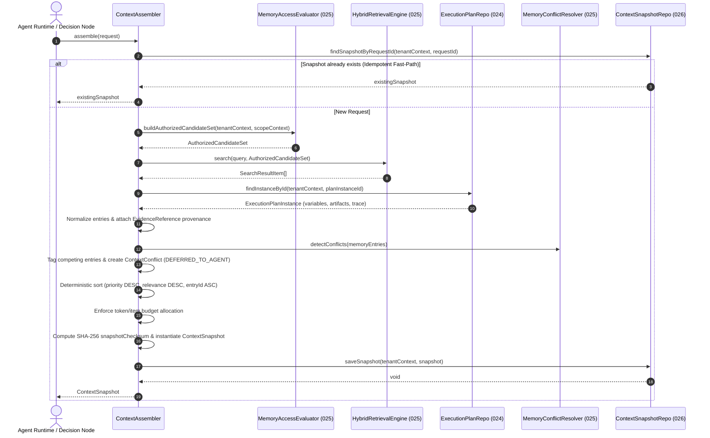

# Capability-026 Walkthrough: Agent Context & Decision Intelligence

## 1. Capability

- **ID**: `capability-026`
- **Name**: Agent Context & Decision Intelligence
- **Status**: Completed
- **Depends On**: `capability-024` (Agent Planning & Workflow Orchestration), `capability-025` (Memory & Knowledge Platform)
- **Owner**: `application-context-intelligence`

---

## 2. Problem Statement

Prior to Capability-026, workflow execution (Capability-024) and memory/knowledge retrieval (Capability-025) operated independently. There was no deterministic, auditable, or authorization-preserving mechanism to compose runtime state (variables, artifacts, trace history) together with authorized long-term memory and external knowledge documents into a single, bounded context for an agent before making a decision.

Without Capability-026:

- Agent components had to ad-hoc fetch memories and variables, risking cross-tenant or cross-workspace leaks.
- Conflicting information (e.g. contradictory memory facts vs. workflow variables) was either silently overwritten or lost.
- There was no immutable record of "what exact context the agent saw" when it made a specific decision, preventing auditability and offline replay.

---

## 3. Design Goals

- **Deterministic Context Assembly**: Identical inputs and identical source states always produce identical context ordering and checksums.
- **Authorization-Preserving**: Authorization is structurally enforced _before_ retrieval. Raw repositories are never queried directly by the assembly layer.
- **Full Provenance & Traceability**: Every context entry carries an explicit, non-null `EvidenceReference` linking back to its exact source, version, checksum, and confidence score.
- **DEFERRED_TO_AGENT Conflict Handling**: Semantic conflicts are detected and preserved without silent data loss. Reasoning belongs to the agent.
- **Immutable Snapshots**: Every successful assembly produces a frozen `ContextSnapshot` with a canonical SHA-256 checksum for audit and replay.
- **Multi-Scope Hierarchy**: Supports combinable scopes (`PLAN_INSTANCE > USER > WORKSPACE > ORGANIZATION > TENANT`) with strict specificity precedence.
- **Zero Modifications to Frozen Capabilities**: Capability-024 (`commit 4bade7b`) and Capability-025 (`commit 80781dc`) remain 100% frozen and unmodified.

---

## 4. Non-Goals

Capability-026 is strictly a **context composition layer**. It is **NOT** responsible for:

- **RAG Reranking / Vector Indexing**: Owned by Capability-025's retrieval engine.
- **Embedding Generation**: Owned by Capability-025 infrastructure adapters.
- **LLM Prompting & Inference**: Owned by `ChatCompletionPort` and agent runtime adapters.
- **Memory Persistence & Lifecycle**: Owned by Capability-025 (`MemoryRecord`, `KnowledgeDocument`).
- **Workflow Execution**: Owned by Capability-024 (`ExecutionScheduler`, `ExecutionDispatcher`).

---

## 5. Architecture & Flow

### 11-Step Deterministic Pipeline

1. **Validate Request**: Validate `ContextAssemblyRequest` parameters, tenant IDs, and scope requirements.
2. **Establish Scope Boundaries**: Build `MemoryScopeContext` for each permitted scope (`PLAN_INSTANCE`, `WORKSPACE`, etc.).
3. **Authorization Evaluation**: Query Capability-025 `MemoryAccessEvaluator.buildAuthorizedCandidateSet()` for permitted scopes.
4. **Authorized Retrieval**: Perform hybrid search via `HybridRetrievalEngine.search()` on authorized candidates only.
5. **Gather Execution State**: Read variables, artifacts, trace history, and system context from Capability-024's `ExecutionPlanInstance` (read-only).
6. **Normalize to ContextEntries**: Map all sources to `ContextEntry` VOs with mandatory `EvidenceReference` provenance.
7. **Detect Semantic Conflicts**: Identify key collisions across memory/knowledge/variables; tag competing entries.
8. **Apply Deterministic Priority**: Compute combined priority: `(scopeSpecificity * 10000) + (sourcePriority * 1000) + Math.round(relevanceScore * 100)`.
9. **Budget Enforcement**: Greedy allocation in priority order up to `tokenBudget` and `maxItems` ceilings.
10. **Create Immutable ContextSnapshot**: Compute canonical SHA-256 checksum over request, entries, and conflicts.
11. **Mandatory Snapshot Persistence**: Save `ContextSnapshot` to tenant-partitioned `ContextSnapshotRepositoryPort`.

---

## 6. Domain Model Breakdown

### Aggregates & Domain Entities

- **`ContextSnapshot`** (Aggregate Root): Immutable record of an assembled context. Contains canonical SHA-256 `snapshotChecksum`, `snapshotId`, `requestId`, tenant context, `entries`, `conflicts`, and `assemblyTrace`.

### Value Objects

- **`ContextAssemblyRequest`**: Incoming request parameters including `requestId` (idempotency key), scope list, query, and budget.
- **`ContextEntry`**: Normalized context item containing content, token estimate, scope, priority, relevance score, conflict status, and evidence reference.
- **`EvidenceReference`**: Discriminated union (`MemoryEvidence | KnowledgeEvidence | ArtifactEvidence | VariableEvidence | ExecutionTraceEvidence | SystemContextEvidence`) providing 100% provenance traceability.
- **`ContextConflict`**: Semantic conflict descriptor preserving competing entry IDs, conflict type, priority metadata, and `resolutionState: 'DEFERRED_TO_AGENT'`.
- **`ContextAssemblyTrace`**: Observability VO capturing timing durations, candidate counts, and token utilization by source type.

### Application Services

- **`ContextAssembler`**: Primary application service orchestrating the 11-step pipeline. Consumes existing public contracts from 024 and 025.

### Ports

- **`ContextSnapshotRepositoryPort`**: Port interface for tenant-isolated snapshot persistence and retrieval.
- **`ContextTokenEstimatorPort`**: Port interface for content token count estimation.

### Infrastructure Adapters

- **`InMemoryContextSnapshotAdapter`**: Tenant-partitioned in-memory snapshot repository.
- **`CharacterBasedTokenEstimator`**: Token estimation adapter using ~4 characters per token approximation.

---

## 7. Sequence Diagram

---

## 8. Why These Decisions? (Design Rationale)

### Why `DEFERRED_TO_AGENT` Conflict Resolution?

**Reason**: Context assembly must never silently destroy or suppress conflicting information. The assembly layer's role is to prepare evidence, not to reason about business domain contradictions. Silently selecting a "winner" at assembly time would hide competing evidence from the LLM or agent, leading to unpredictable decisions that cannot be debugged.

### Why Static Source Priority Order (`SYSTEM_CONTEXT > VARIABLE > ARTIFACT > EXECUTION_TRACE > MEMORY > KNOWLEDGE`)?

**Reason**: System rules (`SYSTEM_CONTEXT`) are non-negotiable. Active execution variables (`VARIABLE`) and node outputs (`ARTIFACT`) represent the immediate state of the current workflow instance. Execution history (`EXECUTION_TRACE`) provides operational context. Long-term learned memories (`MEMORY`) and external documents (`KNOWLEDGE`) provide background context. Ordering this statically ensures deterministic precedence when sorting under budget limits.

### Why Multi-Scope Hierarchy (`PLAN_INSTANCE > USER > WORKSPACE > ORGANIZATION > TENANT`)?

**Reason**: Scope specificity dictates relevance. A variable or memory specific to the current `PLAN_INSTANCE` is more relevant to the immediate decision than a general `WORKSPACE` rule. Giving higher specificity a numeric boost (`PLAN_INSTANCE: 50000`, `WORKSPACE: 30000`, etc.) guarantees that instance-specific context is preferred under token budget constraints.

### Why Mandatory Immutable `ContextSnapshot` with SHA-256 Checksum?

**Reason**: AI agent decisions must be auditable and reproducible. By persisting an immutable snapshot of the exact context provided to the agent, system operators can answer "Why did the agent make decision X at timestamp Y?" and replay the exact decision offline.

### Why Constructor-Level Authorization Preservation?

**Reason**: `ContextAssembler`'s constructor accepts `MemoryAccessEvaluator` and `HybridRetrievalEngine`, NOT raw `MemoryRepositoryPort` or `KnowledgeRepositoryPort`. This structural choice prevents any developer from accidentally bypassing Capability-025's authorization checks.

---

## 9. Future Extension Points

- **Vector Reranker Integration**: Plug a cross-encoder / vector reranker into `HybridRetrievalEngine` without changing `ContextAssembler`.
- **BPE Model-Specific Tokenizer**: Swap `CharacterBasedTokenEstimator` for `TiktokenEstimator` implementing `ContextTokenEstimatorPort`.
- **Semantic Context Caching**: Add a Redis / Memcached adapter behind `ContextSnapshotRepositoryPort` for high-throughput decision nodes.
- **Graph Retrieval Adapter**: Ingest knowledge graph triples as `ContextEntry` items with `EvidenceReference`.
- **MCP Connectors**: Ingest live external Model Context Protocol (MCP) tool outputs as `ContextEntry` items.
- **Streaming Context Assembly**: Stream context entries incrementally for long-context LLMs.

---

## 10. Known Limitations

- **Token Estimator**: The default adapter (`CharacterBasedTokenEstimator`) uses character-based estimation (`~4 chars/token`). While fast and dependency-free, it is an approximation compared to BPE tokenizers like `tiktoken`.
- **Snapshot Storage**: The initial infrastructure adapter (`InMemoryContextSnapshotAdapter`) is an in-memory store suitable for single-node development and testing. Production deployments should replace this with a PostgreSQL / DynamoDB adapter.

---

## 11. Tests & Quality Gates

### Unit & Contract Tests

- **Contract Tests**: 16 dedicated contract tests in [`src/infrastructure/context-intelligence/context-intelligence.contract.test.ts`](file:///Users/tarikozbalkan/www/LI-KITCHEN/src/infrastructure/context-intelligence/context-intelligence.contract.test.ts).
- **Total Repository Test Suite**: 220 passed tests across 68 test files.

### Quality Gate Results

- `pnpm typecheck`: **PASS (0 errors)**
- `npx eslint src --quiet`: **PASS (0 errors)**
- `npx vitest run`: **PASS (220/220 passed)**
- `npx dependency-cruiser src`: **PASS (0 violations)**
- `git diff` on 024 and 025 files: **0 lines changed (100% frozen isolation)**

---

## 12. ADR References

- **[ADR-014: Context Assembly Boundary](file:///Users/tarikozbalkan/www/LI-KITCHEN/.ai/handbook/adr/ADR-014-context-assembly-boundary.md)**: Establishes 026 as a composition layer that does not own retrieval, memory lifecycle, or execution state.
- **[ADR-015: Authorization Preservation in Context Assembly](file:///Users/tarikozbalkan/www/LI-KITCHEN/.ai/handbook/adr/ADR-015-authorization-preservation-in-context-assembly.md)**: Documents that `ContextAssembler` never directly accesses raw memory or knowledge repositories.
- **[ADR-016: Deterministic Context Selection](file:///Users/tarikozbalkan/www/LI-KITCHEN/.ai/handbook/adr/ADR-016-deterministic-context-selection.md)**: Defines static source priority, DEFERRED_TO_AGENT conflict handling, tie-breaking, and mandatory snapshot persistence.

---

## 13. Next Capabilities

- **Capability-027**: Agent Execution & Tool Invocation Runtime (builds on top of Capability-026 decision context snapshots for deterministic tool dispatching).
