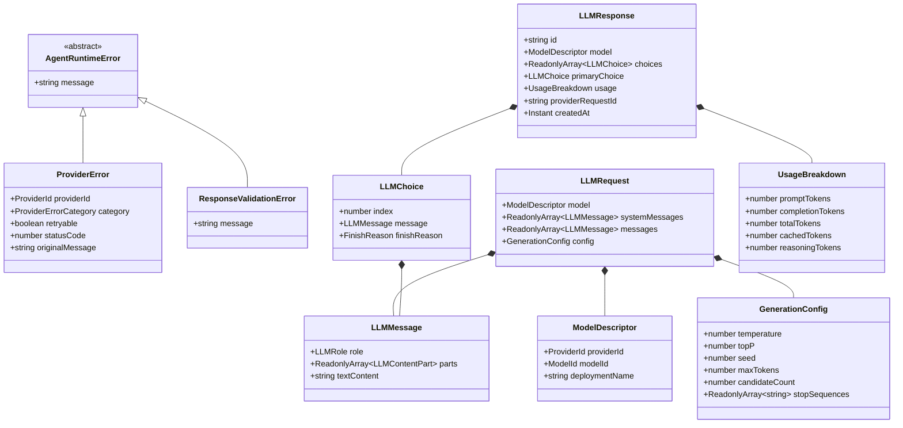
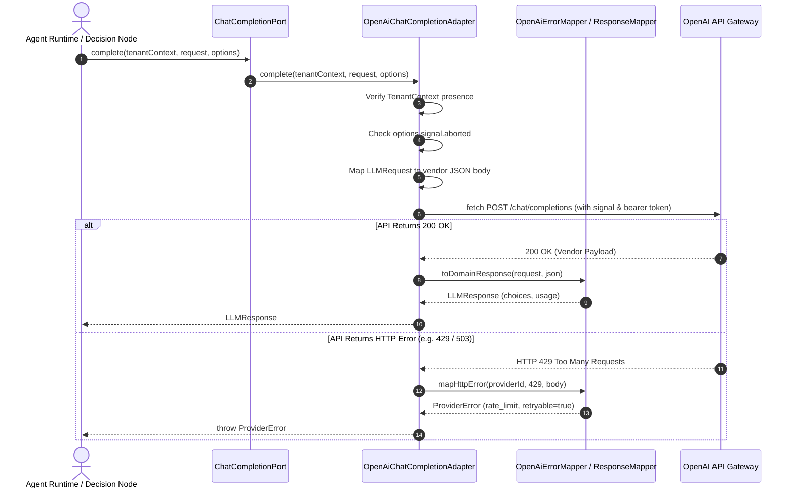

# Capability-027 Iteration 1 Walkthrough: Unified LLM Chat Completion Contract

## 1. Architecture Status & Lifecycle

### Capability Lifecycle

| Lifecycle Stage                | Status     | Notes                                                                                                                                                                    |
| ------------------------------ | ---------- | ------------------------------------------------------------------------------------------------------------------------------------------------------------------------ |
| **1. Planning**                | ✔ Complete | Scope defined; Tool Calling & Streaming deferred to Iterations 2 & 5                                                                                                     |
| **2. ADR Sign-off**            | ✔ Accepted | [ADR-017](file:///.ai/handbook/adr/ADR-017-llm-provider-contract.md) accepted                                                                                            |
| **3. Domain VOs & Errors**     | ✔ Complete | Pure immutable VOs (`LLMRequest`, `LLMResponse`, `GenerationConfig`, `UsageBreakdown`) & `AgentRuntimeError` hierarchy                                                   |
| **4. Ports Definition**        | ✔ Complete | Clean `ChatCompletionPort` with `complete(tenantContext, request, options)`                                                                                              |
| **5. Infrastructure Adapters** | ✔ Complete | Stateless `InMemoryChatCompletionAdapter` & `OpenAiChatCompletionAdapter` with `OpenAiErrorMapper`                                                                       |
| **6. Contract Test Suite**     | ✔ Complete | 9 dedicated contract tests in [`chat-completion.contract.test.ts`](file:///Users/tarikozbalkan/www/LI-KITCHEN/src/infrastructure/agent/chat-completion.contract.test.ts) |
| **7. Quality Gates**           | ✔ Passed   | 241/241 vitest suite tests passed, 0 type errors, 0 eslint errors, 0 dependency-cruiser violations                                                                       |

### Status Summary

| Property                   | Value                                                                                      |
| -------------------------- | ------------------------------------------------------------------------------------------ |
| **Capability ID**          | `capability-027` (Iteration 1)                                                             |
| **Name**                   | Agent Execution & Tool Invocation Runtime — LLM Contract                                   |
| **Status**                 | Production Ready                                                                           |
| **Frozen Status**          | Active baseline for Capability-027 Iteration 2                                             |
| **Owner**                  | `application-agent-runtime`                                                                |
| **Depends On**             | Capability-024 (Execution), Capability-025 (Memory), Capability-026 (Context Intelligence) |
| **Consumed By**            | Capability-027 Iteration 2 (Tool Execution & Dispatcher)                                   |
| **Breaking Changes**       | None                                                                                       |
| **Backward Compatibility** | Fully compatible (0 changes to 024, 025, 026)                                              |

---

## 2. Problem Statement

Prior to Capability-027 Iteration 1, AI interactions relied on direct vendor SDK shapes or ad-hoc wrappers.

Without Capability-027 Iteration 1:

- Infrastructure provider details (e.g. OpenAI `choices`, Anthropic `content` blocks, Gemini `candidates`) leaked into application code.
- Assuming single-message responses broke multi-candidate completion (`n > 1`, self-consistency).
- Raw HTTP/SDK errors (e.g., `AxiosError`, `APIError`) leaked into application layers without retryability classification.

---

## 3. Design Goals

- **Provider & Vendor Independence**: Application and domain layers are 100% agnostic to concrete LLM vendors.
- **Single-Responsibility Port**: `ChatCompletionPort` strictly handles prompt execution and response normalization. It does NOT own retries, fallback routing, or prompt templating.
- **Multi-Output Ready**: `LLMResponse` contains an array of choices (`choices: ReadonlyArray<LLMChoice>`) with a `primaryChoice` convenience getter.
- **Structured Generation Config**: Hyperparameters are grouped inside a dedicated `GenerationConfig` VO.
- **Hierarchical Runtime Error Hierarchy**: All runtime errors derive from `AgentRuntimeError` (`ProviderError`, `ResponseValidationError`, `ContextWindowExceededError`).
- **Explicit Error Mapping Table**: Standardized mapping from vendor HTTP/SDK errors to domain `ProviderErrorCategory` and `retryable` status.
- **Cancellation Forwarding**: `complete()` accepts an optional `{ signal?: AbortSignal }` for clean cancellation.
- **Zero Modifications to Frozen Capabilities**: Capability-024, 025, and 026 remain 100% frozen and unmodified.

---

## 4. Non-Goals (Deferred to Later Iterations)

- ❌ **Tool Calling / Dispatching**: Deferred to Iteration 2.
- ❌ **ReAct Reasoning Loop**: Deferred to Iteration 3.
- ❌ **Application Retry & Fallback Decorators**: Deferred to Iteration 4.
- ❌ **Response Streaming & Token Accounting**: Deferred to Iteration 5.

---

## 5. Domain Model & Class Layout

---

## 6. Sequence Diagram

---

## 7. Production Checklist

- [x] **Unit Tests**: 100% domain VO & adapter logic covered (`llm-vo.test.ts`, `adapters.test.ts`)
- [x] **Contract Tests**: 9 dedicated contract tests passing (`chat-completion.contract.test.ts`)
- [x] **Typecheck**: `pnpm typecheck` — 0 errors
- [x] **ESLint**: `npx eslint src --quiet` — 0 errors
- [x] **Dependency Cruiser**: `npx dependency-cruiser src` — 0 violations
- [x] **Frozen Isolation**: `pnpm check:frozen` — PASSED (024, 025, 026 byte-for-byte unchanged)
- [x] **ADR Documentation**: [ADR-017](file:///.ai/handbook/adr/ADR-017-llm-provider-contract.md) accepted
- [x] **Backward Compatibility**: Fully backward compatible

---

## 8. Next Iteration

- **Capability-027 Iteration 2**: Tool Execution Port & Tool Resolver Dispatcher (`ToolExecutionPort`, `ToolDispatcher`, `ToolResultContentPart`).
