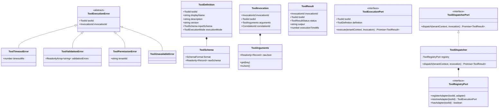
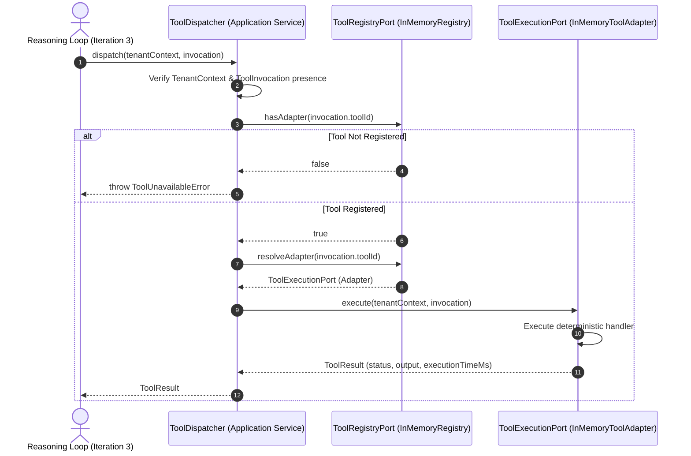

# Capability-027 Iteration 2 Walkthrough: Tool Execution Port & Tool Dispatcher Boundary

## 1. Architecture Status & Lifecycle

### Capability Lifecycle

| Lifecycle Stage                | Status     | Notes                                                                                                                                                                      |
| ------------------------------ | ---------- | -------------------------------------------------------------------------------------------------------------------------------------------------------------------------- |
| **1. Planning**                | ✔ Complete | Scope defined; Tool selection & ReAct loop deferred to Iteration 3                                                                                                         |
| **2. ADR Sign-off**            | ✔ Accepted | [ADR-018](file:///.ai/handbook/adr/ADR-018-tool-invocation-lifecycle.md) accepted                                                                                          |
| **3. Domain VOs & Errors**     | ✔ Complete | Pure VOs (`ToolDefinition`, `ToolInvocation`, `ToolResult`, `ToolSchema`, `ToolArguments`) & `ToolExecutionError` hierarchy                                                |
| **4. Ports Definition**        | ✔ Complete | SRP separated interfaces: `ToolExecutionPort`, `ToolRegistryPort`, `ToolDispatcherPort`                                                                                    |
| **5. Application Services**    | ✔ Complete | Immutable `ToolDispatcher` application service                                                                                                                             |
| **6. Infrastructure Adapters** | ✔ Complete | `InMemoryToolRegistryAdapter` (Map storage, duplicate protection) & `InMemoryToolExecutionAdapter`                                                                         |
| **7. Contract Test Suite**     | ✔ Complete | 7 contract & integration tests in [`tool-execution.contract.test.ts`](file:///Users/tarikozbalkan/www/LI-KITCHEN/src/infrastructure/agent/tool-execution.contract.test.ts) |
| **8. Quality Gates**           | ✔ Passed   | 256/256 vitest suite tests passed, 0 type errors, 0 eslint errors, 0 dependency-cruiser violations                                                                         |

### Status Summary

| Property                   | Value                                                                                                                    |
| -------------------------- | ------------------------------------------------------------------------------------------------------------------------ |
| **Capability ID**          | `capability-027` (Iteration 2)                                                                                           |
| **Name**                   | Agent Execution Runtime — Tool Invocation & Dispatcher Boundary                                                          |
| **Status**                 | Production Ready                                                                                                         |
| **Frozen Status**          | Active baseline for Capability-027 Iteration 3                                                                           |
| **Owner**                  | `application-agent-runtime`                                                                                              |
| **Depends On**             | Capability-024 (Execution), Capability-025 (Memory), Capability-026 (Context), Capability-027 Iteration 1 (LLM Contract) |
| **Consumed By**            | Capability-027 Iteration 3 (ReAct Reasoning Loop)                                                                        |
| **Breaking Changes**       | None                                                                                                                     |
| **Backward Compatibility** | Fully compatible (0 changes to 024, 025, 026, 027-I1)                                                                    |

---

## 2. Problem Statement

Prior to Capability-027 Iteration 2:

- Tool execution logic was tightly bound to ad-hoc handlers without strict SRP boundaries.
- Dispatcher interfaces allowed mutable tool registration during runtime execution, violating immutability.
- Tool outputs were coupled to LLM content structures, leaking transport concerns into pure tool adapters.

---

## 3. Design Goals

- **Strict SRP Separation**: `ToolRegistryPort` handles tool registration and resolution during bootstrap; `ToolDispatcherPort` handles immutable runtime execution dispatching.
- **Zero Tool Selection**: `ToolDispatcher` strictly dispatches matched invocations; tool selection logic is owned by Reasoning Loop (Iteration 3).
- **LLM-Independent Outputs**: `ToolResult` carries raw normalized output strings; LLM content part translation is deferred to Iteration 3.
- **Typed Value Objects**: `ToolSchema` encapsulates JSON schema specs; `ToolArguments` encapsulates invocation parameters.
- **Hierarchical Tool Errors**: `ToolExecutionError` base class with `ToolTimeoutError`, `ToolValidationError`, `ToolPermissionError`, and `ToolUnavailableError`.
- **Zero Modifications to Frozen Code**: Capability-024, 025, 026, and 027-I1 remain 100% frozen.

---

## 4. Class & Component Layout

---

## 5. Sequence Diagram

---

## 6. Production Checklist

- [x] **Unit & Integration Tests**: 100% domain VO, error, and dispatcher service logic covered
- [x] **Contract Tests**: 7 dedicated contract tests passing (`tool-execution.contract.test.ts`)
- [x] **Typecheck**: `pnpm typecheck` — 0 errors
- [x] **ESLint**: `npx eslint src --quiet` — 0 errors
- [x] **Dependency Cruiser**: `npx dependency-cruiser src` — 0 violations
- [x] **Frozen Isolation**: `pnpm check:frozen` — PASSED (024, 025, 026, 027-I1 byte-for-byte unchanged)
- [x] **ADR Documentation**: [ADR-018](file:///.ai/handbook/adr/ADR-018-tool-invocation-lifecycle.md) accepted
- [x] **Backward Compatibility**: Fully backward compatible

---

## 7. Next Iteration

- **Capability-027 Iteration 3**: ReAct Reasoning Loop & State Machine Router (`ReasoningState`, `ReActCycleEngine`, `PromptAssemblerStage`).
