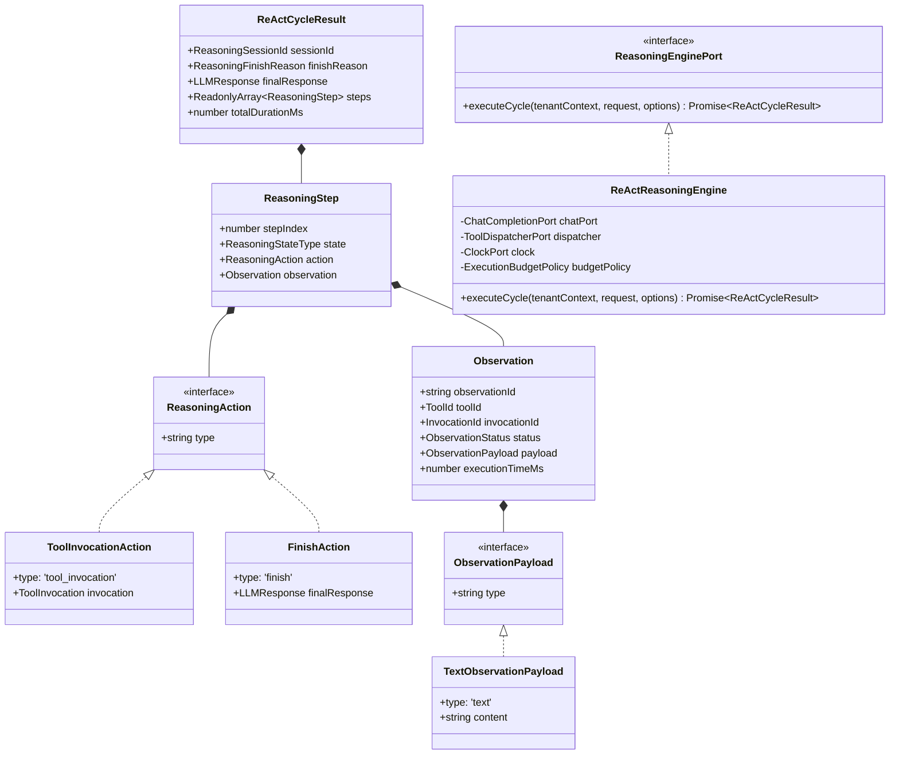
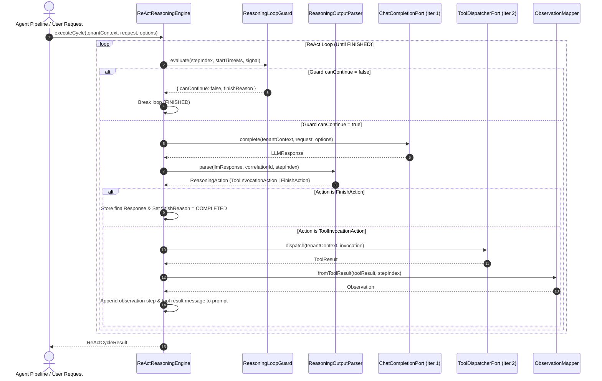

# Capability-027 Iteration 3 Walkthrough: ReAct Reasoning Loop & State Machine Router

## 1. Architecture Status & Lifecycle

### Capability Lifecycle

| Lifecycle Stage             | Status     | Notes                                                                                                                                                                    |
| --------------------------- | ---------- | ------------------------------------------------------------------------------------------------------------------------------------------------------------------------ |
| **1. Planning**             | ✔ Complete | Scope defined; ReAct state machine & termination rules                                                                                                                   |
| **2. ADR Sign-off**         | ✔ Accepted | [ADR-019](file:///.ai/handbook/adr/ADR-019-deterministic-react-reasoning-state-machine.md) accepted                                                                      |
| **3. Domain VOs & Actions** | ✔ Complete | Pure VOs (`ReasoningAction`, `ObservationPayload`, `ReasoningStep`, `ReActCycleResult`)                                                                                  |
| **4. Ports & Helpers**      | ✔ Complete | `ReasoningEnginePort`, `ReasoningOutputParser`, `ObservationMapper`, `ReasoningLoopGuard`                                                                                |
| **5. Application Services** | ✔ Complete | Stateless `ReActReasoningEngine` application service                                                                                                                     |
| **6. IoC Registration**     | ✔ Complete | Registered `ReasoningEnginePort` in `src/bootstrap/register-providers.ts`                                                                                                |
| **7. Contract Test Suite**  | ✔ Complete | 4 dedicated contract tests in [`react-reasoning.contract.test.ts`](file:///Users/tarikozbalkan/www/LI-KITCHEN/src/infrastructure/agent/react-reasoning.contract.test.ts) |
| **8. Quality Gates**        | ✔ Passed   | 277/277 vitest suite tests passed, 0 type errors, 0 eslint errors, 0 dependency-cruiser violations                                                                       |

### Status Summary

| Property                   | Value                                                                                                 |
| -------------------------- | ----------------------------------------------------------------------------------------------------- |
| **Capability ID**          | `capability-027` (Iteration 3)                                                                        |
| **Name**                   | Agent Execution Runtime — ReAct Reasoning Loop & State Machine Router                                 |
| **Status**                 | Production Ready                                                                                      |
| **Frozen Status**          | Active baseline for Capability-027 Iteration 4                                                        |
| **Owner**                  | `application-agent-runtime`                                                                           |
| **Depends On**             | Capability-024 (Execution), Capability-025 (Memory), Capability-026 (Context), Capability-027 I1 & I2 |
| **Consumed By**            | Capability-027 Iteration 4 (Application Resilience & Retry Policies)                                  |
| **Breaking Changes**       | None                                                                                                  |
| **Backward Compatibility** | Fully compatible (0 changes to 024, 025, 026, 027-I1, 027-I2)                                         |

---

## 2. Problem Statement

Prior to Capability-027 Iteration 3:

- LLM prompt completions were execution steps without a formal ReAct reasoning state machine loop.
- Reasoning actions were tied directly to tool invocation objects, preventing non-tool actions (e.g. `FinishAction`, `ReflectionAction`).
- Steps, observations, max step limits, and cancellation signals were not managed deterministically.

---

## 3. Design Goals

- **Deterministic State Machine**: Reasoning cycle transitions through explicit states (`PROMPTING_LLM` -> `EVALUATING_OUTPUT` -> `EXECUTING_TOOL` -> `OBSERVING_RESULT` -> `FINISHED`).
- **Stateless ReActReasoningEngine**: Engine instance holds 0 mutable state; uses local iteration variables and constructor-injected dependencies.
- **Decomposed Helpers**:
  - `ReasoningOutputParser`: Translates `LLMResponse` into `ReasoningAction`.
  - `ObservationMapper`: Translates `ToolResult` into `Observation` VO with `ObservationPayload`.
  - `ReasoningLoopGuard`: Evaluates step limits, timeouts, and `AbortSignal` cancellation.
- **Extensible Action Hierarchy**: Polymorphic `ReasoningAction` union (`ToolInvocationAction | FinishAction | ResponseAction | ReflectionAction`).
- **Multimodal Ready Observations**: `ObservationPayload` (`TextObservationPayload`) prevents string lock-in for future tool outputs.
- **Single Source of Truth**: `ReActCycleResult` contains a single immutable list of `steps: ReadonlyArray<ReasoningStep>`.
- **Zero Modifications to Frozen Code**: Capabilities 024, 025, 026, 027-I1, and 027-I2 remain 100% frozen.

---

## 4. Class & Component Layout

---

## 5. Sequence Diagram

---

## 6. Production Checklist

- [x] **Unit & Integration Tests**: 100% domain VO, error, and engine logic covered
- [x] **Contract Tests**: 4 dedicated contract tests passing (`react-reasoning.contract.test.ts`)
- [x] **Typecheck**: `pnpm typecheck` — 0 errors
- [x] **ESLint**: `npx eslint src --quiet` — 0 errors
- [x] **Dependency Cruiser**: `npx dependency-cruiser src` — 0 violations
- [x] **Frozen Isolation**: `pnpm check:frozen` — PASSED (024, 025, 026, 027-I1, 027-I2 100% frozen)
- [x] **ADR Documentation**: [ADR-019](file:///.ai/handbook/adr/ADR-019-deterministic-react-reasoning-state-machine.md) accepted
- [x] **Backward Compatibility**: Fully backward compatible

---

## 7. Next Iteration

- **Capability-027 Iteration 4**: Application Resilience & Retry Policies (`RetryChatCompletionDecorator`, `CircuitBreakerToolDecorator`).
