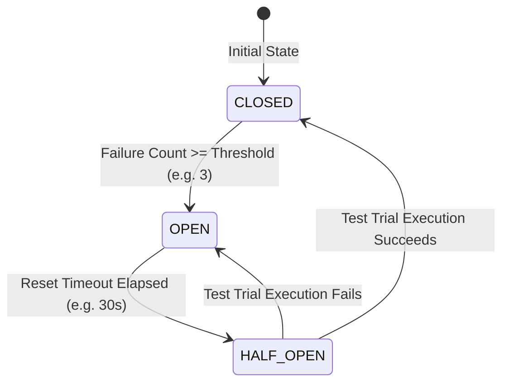

# Capability-027 Iteration 4 Walkthrough: Application Resilience & Retry Decorators

## 1. Architecture Status & Lifecycle

### Capability Lifecycle

| Lifecycle Stage                  | Status     | Notes                                                                                                                                                                                |
| -------------------------------- | ---------- | ------------------------------------------------------------------------------------------------------------------------------------------------------------------------------------ |
| **1. Planning**                  | ✔ Complete | Non-intrusive decorator resilience pattern & timeout hierarchy                                                                                                                       |
| **2. ADR Sign-off**              | ✔ Accepted | [ADR-020](file:///.ai/handbook/adr/ADR-020-resilient-execution-decorators.md) accepted                                                                                               |
| **3. Resilience VOs & Policies** | ✔ Complete | `BackoffPolicy`, `TransientErrorRetryDecisionPolicy`, `RetryPolicy`, `CircuitBreakerPolicy`                                                                                          |
| **4. Application Decorators**    | ✔ Complete | `RetryChatCompletionDecorator`, `CircuitBreakerToolDecorator`                                                                                                                        |
| **5. Clock & Delay Abstraction** | ✔ Complete | `DelayPort`, `SystemDelay`, `FakeDelay`                                                                                                                                              |
| **6. IoC Registration**          | ✔ Complete | Static decorator wrapping in `src/bootstrap/register-providers.ts`                                                                                                                   |
| **7. Contract Test Suite**       | ✔ Complete | 3 dedicated contract tests in [`resilience-decorators.contract.test.ts`](file:///Users/tarikozbalkan/www/LI-KITCHEN/src/infrastructure/agent/resilience-decorators.contract.test.ts) |
| **8. Quality Gates**             | ✔ Passed   | 291/291 vitest suite tests passed, 0 type errors, 0 eslint errors, 0 dependency-cruiser violations                                                                                   |

### Status Summary

| Property                   | Value                                                                     |
| -------------------------- | ------------------------------------------------------------------------- |
| **Capability ID**          | `capability-027` (Iteration 4)                                            |
| **Name**                   | Agent Execution Runtime — Application Resilience & Retry Decorators       |
| **Status**                 | Production Ready                                                          |
| **Frozen Status**          | Active baseline for Capability-027 Iteration 5                            |
| **Owner**                  | `application-agent-runtime`                                               |
| **Depends On**             | Capability-024, Capability-025, Capability-026, Capability-027 I1, I2, I3 |
| **Consumed By**            | Capability-027 Iteration 5 (Response Streaming & Token Accounting)        |
| **Breaking Changes**       | None                                                                      |
| **Backward Compatibility** | Fully compatible (0 changes to 024, 025, 026, 027-I1..I3)                 |

---

## 2. Component Architecture & Layering

```text
Composition Root Setup (register-providers.ts):

Chat Completion Pipeline:
ChatCompletionPort -> RetryChatCompletionDecorator -> OpenAiChatCompletionAdapter

Tool Execution Pipeline:
ToolExecutionPort -> CircuitBreakerToolDecorator -> InMemoryToolExecutionAdapter

Reasoning Engine Layer:
ReActReasoningEngine (Unaware of retries & circuit breakers)
```

---

## 3. Circuit Breaker State Machine Lifecycle



---

## 4. Production Checklist

- [x] **Unit & Integration Tests**: 100% policy VOs, decorator execution, and error handling covered
- [x] **Contract Tests**: 3 dedicated contract tests passing (`resilience-decorators.contract.test.ts`)
- [x] **Typecheck**: `pnpm typecheck` — 0 errors
- [x] **ESLint**: `npx eslint src --quiet` — 0 errors
- [x] **Dependency Cruiser**: `npx dependency-cruiser src` — 0 violations
- [x] **Frozen Isolation**: `pnpm check:frozen` — PASSED (024, 025, 026, 027-I1..I3 100% frozen)
- [x] **ADR Documentation**: [ADR-020](file:///.ai/handbook/adr/ADR-020-resilient-execution-decorators.md) accepted
- [x] **Backward Compatibility**: Fully backward compatible

---

## 5. Next Iteration

- **Capability-027 Iteration 5**: Response Streaming & Token Accounting (`StreamingChatCompletionPort`, `TokenUsageAccountingDecorator`).
