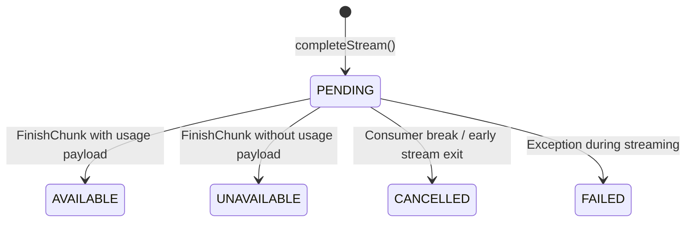

# Capability-027 Iteration 5B Walkthrough: Token Accounting & Usage Normalization Decorators

## 1. Architecture Status & Lifecycle

### Capability Lifecycle

| Lifecycle Stage               | Status     | Notes                                                                                                                                                                      |
| ----------------------------- | ---------- | -------------------------------------------------------------------------------------------------------------------------------------------------------------------------- |
| **1. Planning**               | ✔ Complete | Token accounting decorators & streaming usage lifecycle state machine                                                                                                      |
| **2. ADR Sign-off**           | ✔ Accepted | [ADR-022](file:///.ai/handbook/adr/ADR-022-token-accounting-and-streaming-usage.md) accepted                                                                               |
| **3. Transport & Decorators** | ✔ Complete | `StreamingChatResponse`, `TokenAccountingChatCompletionDecorator`, `TokenAccountingStreamingDecorator`                                                                     |
| **4. Lifecycle States**       | ✔ Complete | `PENDING`, `AVAILABLE`, `UNAVAILABLE`, `CANCELLED`, `FAILED` (`FAILED != UNAVAILABLE`)                                                                                     |
| **5. IoC Registration**       | ✔ Complete | Registered accounting decorators in `src/bootstrap/register-providers.ts`                                                                                                  |
| **6. Contract Test Suite**    | ✔ Complete | 5 dedicated contract tests in [`token-accounting.contract.test.ts`](file:///Users/tarikozbalkan/www/LI-KITCHEN/src/infrastructure/agent/token-accounting.contract.test.ts) |
| **7. Quality Gates**          | ✔ Passed   | 311/311 vitest suite tests passed, 0 type errors, 0 eslint errors, 0 dependency-cruiser violations                                                                         |

### Status Summary

| Property                   | Value                                                                                       |
| -------------------------- | ------------------------------------------------------------------------------------------- |
| **Capability ID**          | `capability-027` (Iteration 5B)                                                             |
| **Name**                   | Agent Execution Runtime — Token Accounting Decorators & Usage Normalization                 |
| **Status**                 | Production Ready                                                                            |
| **Frozen Status**          | Active baseline for Capability-027 Complete Runtime Release                                 |
| **Owner**                  | `application-agent-runtime`                                                                 |
| **Depends On**             | Capability-024..026, Capability-027 I1..I5A                                                 |
| **Consumed By**            | Capability-028 (Autonomous Task Planner) & Capability-029 (Multi-Agent Swarm Orchestration) |
| **Breaking Changes**       | None                                                                                        |
| **Backward Compatibility** | Fully compatible (0 changes to 024..026, 027-I1..I5A)                                       |

---

## 2. Streaming Usage Lifecycle State Machine

---

## 3. Production Checklist

- [x] **Unit & Integration Tests**: 100% decorators and `StreamingChatResponse` lifecycle covered
- [x] **Contract Tests**: 5 dedicated contract tests passing (`token-accounting.contract.test.ts`)
- [x] **Typecheck**: `pnpm typecheck` — 0 errors
- [x] **ESLint**: `npx eslint src --quiet` — 0 errors
- [x] **Dependency Cruiser**: `npx dependency-cruiser src` — 0 violations
- [x] **Frozen Isolation**: `pnpm check:frozen` — PASSED (024..026, 027-I1..I5A 100% frozen)
- [x] **ADR Documentation**: [ADR-022](file:///.ai/handbook/adr/ADR-022-token-accounting-and-streaming-usage.md) accepted
- [x] **Backward Compatibility**: Fully backward compatible

---

## 4. Capability-027 Milestone Complete

Capability-027 (Agent Execution & Tool Invocation Runtime) iterations I1 through I5B are fully complete, tested, and frozen.
