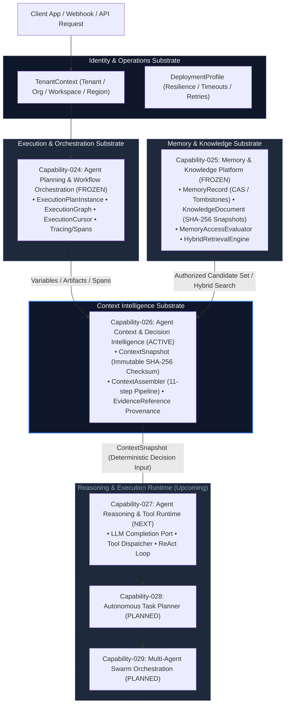

# Platform Overview: Agent Intelligence & Execution Substrate

## Executive Summary

This repository implements an enterprise-grade, multi-tenant AI Agent Platform designed according to **Clean Architecture** (ADR-009), **Hexagonal Architecture / Ports & Adapters** (ADR-012), and **Domain-Driven Design** (ADR-010, ADR-013).

The platform separates execution state, long-term memory, context intelligence, reasoning, tool execution, and prompt authoring into decoupled, single-responsibility capability layers with zero breaking changes and strict frozen boundaries.

---

## High-Level Architecture Diagram



---

## End-to-End Data & Request Flow

```text
1. REQUEST INGESTION
   Caller Request → TenantContext Validation → Rate Limiter & Resilience Decorator

2. PLAN & WORKFLOW ORCHESTRATION (Capability-024)
   Planner Strategy → ExecutionGraph Construction → ExecutionPlanInstance Instantiation
   → ExecutionScheduler Claims Nodes → ExecutionDispatcher Node Execution Cursor

3. AUTHORIZATION & MEMORY RETRIEVAL (Capability-025)
   TenantContext + MemoryScopeContext → MemoryAccessEvaluator (Tenant & Scope Boundary Checks)
   → AuthorizedCandidateSet → HybridRetrievalEngine (Semantic + Keyword + Recency + Freshness)

4. CONTEXT INTELLIGENCE & ASSEMBLY (Capability-026)
   ContextAssemblyRequest → Scope Specificity Hierarchy → Gather 024 State (Variables/Artifacts/Spans)
   + Gather 025 Memory & Knowledge → Normalize Entries with EvidenceReference Provenance
   → Detect Semantic Conflicts (DEFERRED_TO_AGENT) → Deterministic Priority Sorting & Budget Truncation
   → Compute Canonical SHA-256 Checksum → Save Immutable ContextSnapshot

5. REASONING & AGENT RUNTIME (Capability-027)
   Input: ContextSnapshot → LLM Reasoning Loop → Tool Resolver & Executor → Output Validation

6. TELEMETRY, AUDIT & PERSISTENCE
   Cost Accounting & Token Telemetry → Tenant Partitioned Outbox Event → Persistent Snapshot Audit
```

---

## Core Capability Layers

| Layer | Capability ID          | Capability Name                 | Primary Responsibility                                          | Status     |
| ----- | ---------------------- | ------------------------------- | --------------------------------------------------------------- | ---------- |
| **0** | `capability-001`–`023` | Core Platform Foundation        | Provider Adapters, Resilience, Prompts, Tools, Identity         | Completed  |
| **1** | `capability-024`       | Agent Planning & Orchestration  | DAG Execution Graphs, Plan Instances, Checkpoints, Compensation | **FROZEN** |
| **2** | `capability-025`       | Memory & Knowledge Platform     | Scoped Memory, CAS Superseding, Tombstones, SHA-256 Knowledge   | **FROZEN** |
| **3** | `capability-026`       | Context & Decision Intelligence | Deterministic Context Assembly, Multi-Scope, DEFERRED_TO_AGENT  | **ACTIVE** |
| **4** | `capability-027`       | Agent Reasoning & Tool Runtime  | LLM Completion Loop, Tool Execution Dispatcher, ReAct Cycle     | Planned    |
| **5** | `capability-028`       | Autonomous Task Planner         | Dynamic Sub-Goal Generation & Re-planning                       | Planned    |
| **6** | `capability-029`       | Multi-Agent Swarm Orchestration | Distributed Agent Delegation & Consensus Engine                 | Planned    |

---

## Security Boundaries & Multi-Tenancy Invariants

1. **Strict Tenant Isolation**: All domain calls, repository queries, and snapshot lookups require a valid `TenantContext`. Cross-tenant data leakage is structurally impossible.
2. **Authorization Before Retrieval**: No candidate retrieval occurs without first passing through `MemoryAccessEvaluator.buildAuthorizedCandidateSet()`.
3. **No Direct Repository Access**: Higher-level composition services (like `ContextAssembler`) take authorized domain services in their constructors, not raw repository ports.
4. **Immutable Audit Trail**: Every execution span (`ExecutionTrace`), memory version (`KnowledgeVersionSnapshot`), and decision context (`ContextSnapshot`) is cryptographically checksummed and immutable.

---

## Architectural Governance & Quality Standards

- **Zero-Breaking-Changes Policy**: Once a capability is marked **FROZEN**, its source code cannot be modified without an explicit, approved ADR exception.
- **Contract Test Coverage**: Every capability must provide dedicated contract tests in `src/infrastructure/<capability>/` verifying tenant isolation, failure modes, and domain invariants.
- **Quality Gates**: All code must pass `pnpm typecheck`, `npx eslint src --quiet`, `npx vitest run`, and `npx dependency-cruiser src` with zero violations before deployment.
