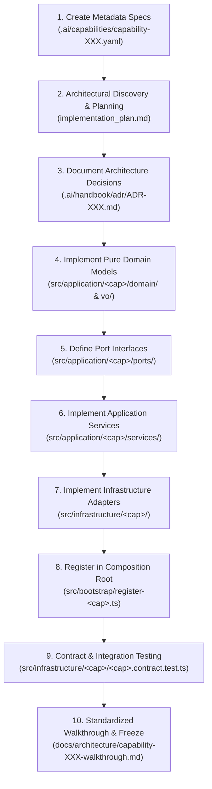

# Playbook: How to Implement a New Capability

This guide documents the standardized, 10-step lifecycle for adding a new capability (e.g. Capability-027, Capability-028) to this repository while preserving Clean Architecture, Domain-Driven Design, and frozen capability boundaries.

---

## 10-Step Capability Lifecycle



---

## Detailed Step-by-Step Instructions

### Step 1: Create Metadata Specs

Create `.ai/capabilities/capability-XXX.yaml` using the standardized schema:

```yaml
id: capability-027
name: Agent Execution & Tool Invocation Runtime
status: in_progress
depends_on:
  - capability-024
  - capability-025
  - capability-026
owner: application-agent-runtime
definition_of_done:
  - pure-domain-models-created
  - ports-and-adapters-implemented
  - contract-tests-100-percent-pass
  - walkthrough-generated
next:
  - capability-028
```

---

### Step 2: Architectural Discovery & Planning

Before writing any code:

1. Perform repository discovery to inspect existing ports, value objects, and frozen contracts.
2. Draft a comprehensive `implementation_plan.md` outlining the problem statement, open decisions, security analysis, test matrix, and file layout.
3. Review and align on all P0/P1 architectural decisions before proceeding.

---

### Step 3: Document Architectural Decisions (ADRs)

If the capability introduces major design choices (e.g. boundary rules, isolation guarantees, selection policies):

- Document each decision as a new Markdown file in `.ai/handbook/adr/ADR-XXX-<name>.md`.
- Numbering must sequentially continue from the last accepted ADR (e.g. ADR-017).

---

### Step 4: Implement Pure Domain Models & Value Objects

Under `src/application/<capability>/domain/` and `src/application/<capability>/vo/`:

- Use **pure TypeScript** (ADR-010, ADR-013). No external library imports (Zod, Prisma, Express, Next).
- All domain objects must be immutable (`Object.freeze(this)` in constructor).
- Encapsulate invariants directly inside value object and aggregate constructors (throw explicit descriptive errors on invalid states).

---

### Step 5: Define Port Interfaces

Under `src/application/<capability>/ports/`:

- Declare clean TypeScript interfaces for repository persistence, token estimation, external service gateways, or outbox publishers.
- All repository methods **must accept `Readonly<TenantContext>` as their first parameter** to guarantee tenant isolation.

---

### Step 6: Implement Application Services

Under `src/application/<capability>/services/`:

- Application services orchestrate domain logic and communicate strictly through ports or authorized domain services.
- **Invariant**: Services must NEVER accept raw infrastructure repository ports of frozen upstream capabilities if authorized evaluation services exist (ADR-015).

---

### Step 7: Implement Infrastructure Adapters

Under `src/infrastructure/<capability>/`:

- Implement concrete adapters for all defined ports (e.g. `InMemory<Name>Adapter`, `Postgres<Name>Adapter`).
- Enforce strict tenant partitioning (`Map<tenantId, Map<id, Entity>>`).
- Perform mapping between raw data shapes and pure domain models at the boundary (ADR-012).

---

### Step 8: Register in Composition Root

1. Create `src/bootstrap/register-<capability>.ts`.
2. Register infrastructure adapters and application services into `ApplicationRegistry`.
3. Import and invoke `register<Capability>(registry)` in `src/bootstrap/register-providers.ts` in proper dependency order.

---

### Step 9: Contract & Integration Testing

Create `src/infrastructure/<capability>/<capability>.contract.test.ts`:

- Include dedicated contract tests covering:
  - **P0 Security**: Cross-tenant isolation, authorization enforcement, frozen dependency protection.
  - **P1 Functionality**: Multi-scope hierarchy, deterministic sorting, provenance, snapshot immutability, idempotency.
  - **P2 Performance**: Token budget enforcement, concurrency safety.
- Run `npx vitest run` to verify 100% test pass with zero regressions across existing capabilities.

---

### Step 10: Standardized Walkthrough & Quality Gates

#### 10a. Create Walkthrough Document

Create `docs/architecture/capability-XXX-walkthrough.md` using the **19-Section Standardized Template**:

1. Architecture Status & Lifecycle
2. Problem Statement
3. Design Goals
4. Non-Goals
5. Capability Dependency & Platform Evolution Graph
6. Alternatives Considered ("Why Not?")
7. Architecture & Pipeline Flow
8. Failure Modes & Degradation Matrix
9. Domain Model & Complexity Metrics
10. Sequence Diagram (`Mermaid`)
11. Why These Decisions? (Design Rationale)
12. Decision Record Summary (ADRs)
13. Operational Risk Assessment
14. Performance & Complexity Characteristics
15. Security Considerations
16. Future Extension Points
17. Known Limitations
18. Production Checklist
19. Next Capabilities

#### 10b. Run Quality Gates

Verify all 4 quality gates pass cleanly:

```bash
pnpm typecheck
npx eslint src --quiet
npx vitest run
npx dependency-cruiser src
```

#### 10c. Verify Frozen Isolation

Verify byte-for-byte zero changes to previously frozen capabilities:

```bash
git diff <last-frozen-commit> -- src/application/<frozen-cap>/ src/infrastructure/<frozen-cap>/
```

#### 10d. Update Capability Status

Update `status: completed` in `.ai/capabilities/capability-XXX.yaml` and mark the capability as **FROZEN**!
